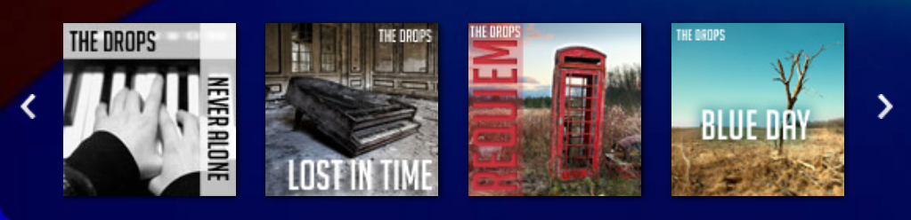

Giới thiệu về lập trình chức năng

Bài viết được dịch từ [A Gentle Introduction to Functional JavaScript: Part 1](https://jrsinclair.com/articles/2016/gentle-introduction-to-functional-javascript-intro/) của blogger James Sinclair nhằm mục đích học tập. Nếu thấy hữu ích bạn có thể theo dõi RSS của [tác giả](https://jrsinclair.com/index.rss)

Phần 1

Viết bởi James Sinclair ngày 29<sup>th</sup> tháng 1 năm 2016

Đây là phần đầu trong 4 phần giởi thiệu về lập trình ‘chức năng’ trong Javascript. Trong bài viết này chúng ta sẽ tìm hiểu về các khối xây dựng cho phép Javascript trở thành ngôn ngữ ‘chức năng’, và tại sao nó lại có ích.

+ Phần 1: Các khối xây dựng và động lực
+ Phần 2: Làm việc với mảng và danh sách (sắp được dịch)
+ Phần 3: Hàm để tạo hàm (sắp được dịch)
+ Phần 4: Làm việc với phong cách (sắp được dịch)

# I. Hàm là gì?

Javascript có thực sự là ngôn ngữ lập trình chức năng? Tại sao lại gọi là lập trình chức năng? Tại sao bạn nên quan tâm?

Với tôi, lập trình chức năng gần giống với [getting a Thermomix](http://youtu.be/4yr_etbfZtQ):

+ Cần bỏ chút vốn đầu tư trước
+ Bạn cần nói với gia đình và bè bạn về sự tuyệt vời của nó
+ Họ bắt đầu nghĩ rằng bạn đang tham số một loại tín ngưỡng nào đó

Nhưng, viết code theo hướng lập trình chức năng giúp thực hiện một số nhiệm vụ dễ dàng hơn. Thậm chí có thể tự động vài công việc bình thường khá tẻ nhạt và tốn thì giờ.

## II Các khối xây dựng

Hãy bắt đầu với vài khái niệm cho phép Javascript khả năng lập trình chức năng, trước khi tiến tới tìm hiểu _tại sao nó lại là ‘ý tưởng’ tốt_. Trong Javascript, chúng ta có 2 khối xây dựng chính: _biến_ và _hàm_. Biến kiểu như là một cái hộp cho ta cất đồ vào. Bạn có tạo một biến như sau:

```js
var myContainer = "Hey everybody! Come see how good I look!";
```

Câu lệnh trên tạo ra một cái hộp tên là **myContainer** và gán một chuỗi vào đó.

Mặt khác, một hàm là cách để nhóm các chỉ thị được sử dụng nhiều lần, hay giúp sắp xếp mọi thứ một cách có tổ chức nhờ đó bạn không phải nghĩ về mọi thứ cùng một lúc. Ta có thể tạo hàm như sau:

```js
function log(someVariable) {
    console.log(someVariable);
    return someVariable;
}
```

Và gọi hàm:

```js
log(myContainer);
// Hey everybody! Come see how good I look!
```

Tuy nhiên, nếu như biết về Javascript trước đó, bạn còn có thể viết và gọi hàm như sau:

```js
var log = function(someVariable) {
    console.log(someVariable);
    return someVariable;
}

log(myContainer);
// Hey everybody! Come see how good I look!
```

Hãy quan sát kĩ. Với cách này, chúng ta vừa tạo một biến có tên là **log** và gán hàm cho nó. Như vậy, hàm **log()** là một biến; có nghĩa ta có thể thao tác với nó như với các biến thông thường khác.

Bởi vì Javascript cho phép truyền biến vào như một tham số khi gọi hàm nên ta cũng có thể thực hiện điều đó với hàm. Hãy cùng thử:

```js
var classyMessage = function() {
    return "Stay classy San Diego!";
}

log(classyMessage);
// [Function]
```

🤨! Hmmmm. Trông có vẻ vô nghĩa. Hãy thử một cách khác:

```js
var doSomething = function(thing) {
    thing();
}

var sayBigDeal = function() {
    var message = "I’m kind of a big deal";
    log(message);
}

doSomething(sayBigDeal);
// I’m kind of a big deal
```

Lúc này, bạn có thể không cảm thấy thích thú, tuy nhiên nó lại khiến các nhà khoa học máy tính vô cùng phấn khích. Khả năng đặt hàm vào trong biến còn được miêu tả là: “Hàm là các công dân số một trong Javascript”**\***. Câu nói này thể hiện hàm hầu như không được đối xử khác so với các giá trị khác, ví dụ như các đối tượng hay chuỗi. Tính năng tưởng chừng nhỏ bé này lại có ý nghĩa vô cùng to lớn. Để tìm hiểu tại sao, chúng ta cần biết nguyên tắc DRY - Don't repeat yourself.

\* nguyên văn: “functions are first class objects in JavaScript.”

# III. DON'T REPEAT YOURSELF

Các lập trình viên hay nói về nguyên tắc DRY - đừng lặp lại chính mình. Ý tưởng hình thành từ việc nếu bạn phải thực hiện một bộ công việc nhiều lần, hãy nhóm chúng vào một thứ có thể sử dụng lại được (vd như hàm). Bằng cách này, mỗi khi bạn cần thay đổi đối với bộ công việc đó, bạn chỉ thực hiện ở một nơi.

Cho ví dụ sau. Giả sử chúng ta muốn đặt 3 cái carousel (hay còn gọi là slider) trong cùng 1 trang sử dụng một thư viện carousel X nào đó:

```js
var el1 = document.getElementById('main-carousel');
var slider1 = new Carousel(el1, 3000);
slider1.init();

var el2 = document.getElementById('news-carousel');
var slider2 = new Carousel(el2, 5000);
slider2.init();

var el3 = document.getElementById('events-carousel');
var slider3 = new Carousel(el3, 7000);
slider3.init();
```


(Ví dụ một carousel)

Đoạn code trên chứa vài chỗ trùng lặp nên hãy thay đổi. Trước hết phải xác định công việc cần tiến hành là khởi tạo carousel cho vài thẻ HTML của trang, mỗi cái có một ID riêng. Hướng giải quyết là nhóm các câu lệnh tạo một carousel vào một hàm và rồi gọi hàm đó cho mỗi một ID.

```js
function initialiseCarousel(id, frequency) {
    var el = document.getElementById(id);
    var slider = new Carousel(el, frequency);
    slider.init();
    return slider;
}

initialiseCarousel('main-carousel', 3000);
initialiseCarousel('news-carousel', 5000);
initialiseCarousel('events-carousel', 7000);
```
Hiện tại code đã gọn gàng hơn và dễ dàng bảo trì. Chúng ta cũng có hướng để làm theo: mỗi khi một tập hợp các thao tác được lặp lại nhiều lần, ta có thể đưa chúng vào trong một hàm. Nhưng sẽ ra sao nếu hành động có sự thay đổi?

```js
var unicornEl = document.getElementById('unicorn');
unicornEl.className += ' magic';
spin(unicornEl);

var fairyEl = document.getElementById('fairy');
fairyEl.className += ' magic';
sparkle(fairyEl);

var kittenEl = document.getElementById('kitten');
kittenEl.className += ' magic';
rainbowTrail(kittenEl);
```

Trường hợp này sẽ phức tạp hơn đôi chút để tổ chức code. Dạng thức này rõ ràng cũng xảy ra việc trùng lặp, chúng ta đang gọi một hàm riêng biệt cho từng thẻ. Ta có thể tránh được chút xíu lặp code khi đưa chỗ `document.getElementById()` và `className` vào một hàm:

```js
function addMagicClass(id) {
    var element = document.getElementById(id);
    element.className += ' magic';
    return element;
}

var unicornEl = addMagicClass('unicorn');
spin(unicornEl);

var fairyEl = addMagicClass('fairy');
sparkle(fairyEl);

var kittenEl = addMagicClass('kitten');
rainbow(kittenEl);
```

Nhưng ta còn có thể bớt lặp code hơn nữa. Như ở trên đã nói Javascript cho phép truyền hàm như là tham số vào trong hàm khác:

```js
function addMagic(id, effect) {
    var element = document.getElementById(id);
    element.className += ' magic';
    effect(element);
}

addMagic('unicorn', spin);
addMagic('fairy', sparkle);
addMagic('kitten', rainbow);
```

Cách này càng khiến code gọn gàng, dễ bảo trì hơn. Như vậy, phần này cho ta biết rằng khả năng truyền hàm vào như với biến có thể vô cùng hữu ích. Phần tiếp theo, chúng ta tiếp tục sử dụng khả năng này khi làm việc với mảng.