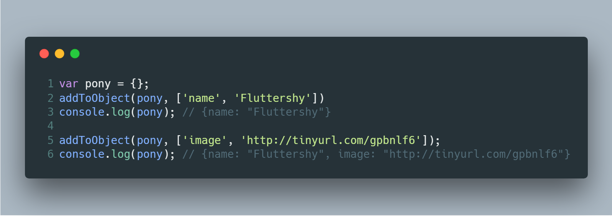
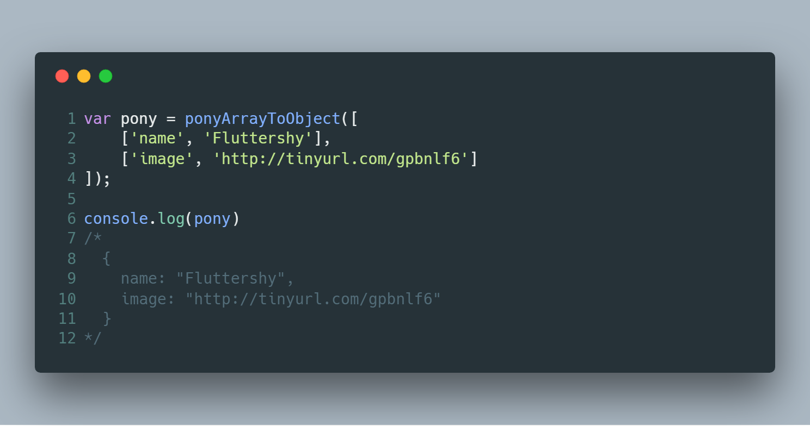
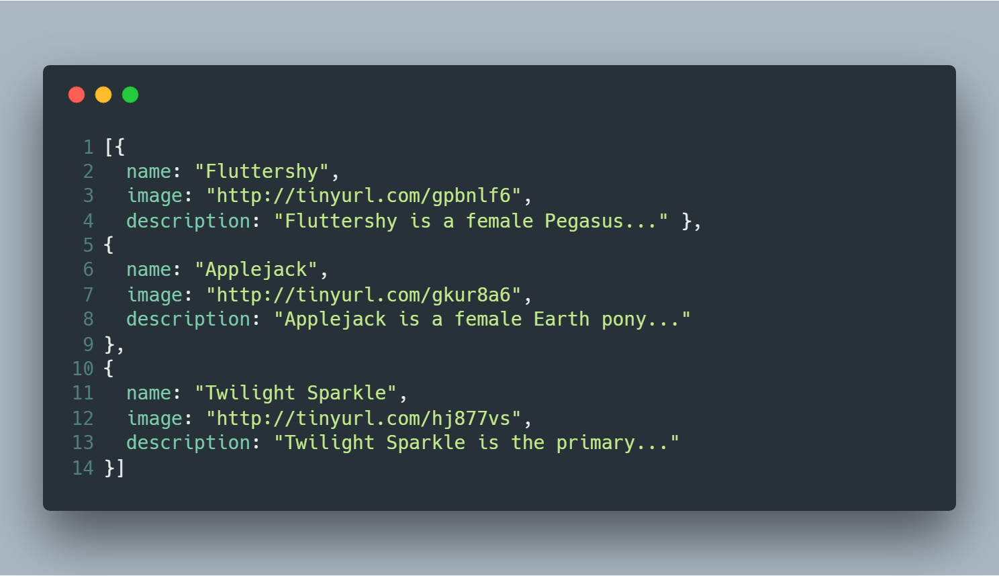

Giới thiệu về lập trình chức năng

Bài viết được dịch từ [A Gentle Introduction to Functional JavaScript: Part 2](https://jrsinclair.com/articles/2016/gentle-introduction-to-functional-javascript-arrays/) của blogger James Sinclair nhằm mục đích học tập. Nếu thấy hữu ích bạn có thể theo dõi RSS của [tác giả](https://jrsinclair.com/index.rss)

Phần 2

Viết bởi James Sinclair ngày 30<sup>th</sup> tháng 1 năm 2016

Đây là phần hai trong 4 phần giởi thiệu về lập trình ‘chức năng’ trong Javascript. Ở phần trước, chúng ta đã thấy cách hàm được sử dụng làm đối số khi gọi tới một hàm khác, qua đó giúp tổ chức code gọn gàng, dễ bảo trì hơn. Ở bài hôm nay, chúng ta sẽ áp dụng kỹ thuật này cho các danh sách.

+ Phần 1: [Các khối xây dựng và động lực](https://medium.com/@vnknowledge/b%C3%A0i-d%E1%BB%8Bch-gi%E1%BB%9Bi-thi%E1%BB%87u-v%E1%BB%81-l%E1%BA%ADp-tr%C3%ACnh-ch%E1%BB%A9c-n%C4%83ng-7508808a39e5)
+ Phần 2: Làm việc với mảng và danh sách
+ Phần 3: Hàm để tạo hàm (sắp được dịch)
+ Phần 4: Làm việc với phong cách (sắp được dịch)

# I. Làm việc với mảng và danh sách

Bài viết trước có đề cập tới nguyên tắc DRY - đừng lặp lại chính mình. Chúng ta sử dụng hàm để nhóm một bộ các hành động được lặp lại. Vậy bạn thấy sao nếu ta viết code gọi tới một hàm nhiều lần? Ví dụ:

```js
function addColour(colour) {
    var rainbowEl = document.getElementById('rainbow');
    var div = document.createElement('div');
    div.style.paddingTop = '10px';
    div.style.backgroundColour = colour;
    rainbowEl.appendChild(div);
}

addColour('red');
addColour('orange');
addColour('yellow');
addColour('green');
addColour('blue');
addColour('purple');
```

Trong đoạn code này, **addColour** được lặp lại khá nhiều. Để tránh việc lặp, giải pháp là đưa danh sách các màu sắc vào một mảng, rồi gọi _addColour_ trong vòng lặp `for`:

```js
var colours = [
    'red', 'orange', 'yellow',
    'green', 'blue', 'purple'
];

for (var i = 0; i < colours.length; i = i + 1) {
    addColour(colours[i]);
}
```

Gọn gàng hơn so với trước đó rồi nhỉ! Nhưng trông vẫn dài dòng khi phải đưa ra cho máy tính các chỉ thị thật cụ thể về việc tạo biến chỉ mục **i**, tăng nó lên, đồng thời kiểm tra xem khi nào thì kết thúc việc lặp. Có phải tốt hơn, nếu ta có thể gom tất cả những thứ ở **vòng for** vào một hàm?

## 1. For-Each

Vì Javascript cho phép dùng hàm làm tham số, ta có thể viết một hàm **forEach** tương đối đơn giản như sau:

```js
function forEach(callback, array) {
    for (var i = 0; i < array.length; i = i + 1) {
        callback(array[i], i);
    }
}
```

Hàm này nhận hàm tên **callback** làm tham số và gọi nó mỗi khi lặp qua một phần tử của mảng.

Để thêm các màu trong danh sách, ta chỉ cần viết 1 dòng như sau:

```js
forEach(addColour, colours);
```

💡 Hơn hết, Javascript trang bị sẵn cho tất cả mảng một phương thức có cùng tên và hoạt động giống như **forEach** viết ở trên:

```js
var colours = [
    'red', 'orange', 'yellow',
    'green', 'blue', 'purple'
];
colours.forEach(addColour);
```

Chú ý: __forEach__ trở lại `undefined`.

Bạn có thể xem thêm về [forEach ở trang Mozilla Developer Network](https://developer.mozilla.org/en-US/docs/Web/JavaScript/Reference/Global_Objects/Array/forEach)

## 2. Map

Dù hàm __forEach__ trên khá tiện lợi, tuy nhiên nó vẫn có điểm hạn chế. Nếu hàm _callback_ được truyền vào có trở lại một giá trị, giá trị này sẽ bị __forEach__ bỏ qua. Lần này ta có thể sửa chút xíu ở __forEach__, để nhận được lại các giá trị mà hàm _callback_ trả về.

Trước tiên quan sát ví dụ sau. Giả sử có một mảng các ID, ta muốn nhận lại được phần tử DOM tương ứng với mỗi một ID. Giải pháp thông thường là một vòng lặp _for_:

```js
var ids = ['unicorn', 'fairy', 'kitten'];
// elements sẽ chứa các phần tử DOM
var elements = [];
for (var i = 0; i < ids.length; i = i + 1) {
    elements[i] = document.getElementById(ids[i]);
}
```

Một lần nữa, chúng ta nói với máy tính cách tạo chỉ mục, tăng giá trị của nó - Đây là chi tiết lẽ ra chúng ta không cần nghĩ tới. Hãy tổ chức lại code, đưa vòng _for_ vào trong hàm tên là __*map*__, tương tự như cách được thực hiện với __*forEach*__:

```js
var map = function(callback, array) {
    var newArray = [];
    for (var i = 0; i < array.length; i = i + 1) {
        newArray[i] = callback(array[i], i);
    }
    return newArray;
}
```

Và sử dụng hàm __map__:

```js
var getElement = function(id) {
  return document.getElementById(id);
};

var elements = map(getElement, ids);
```

Khi thực thi, nó gọi hàm _getElement_ trên mọi phần tử của mảng _ids_. Thay đổi không nhiều so với __forEach__, __map__ đã có thể trả về các giá trị từ _callback_. Kết quả ”thu hoạch” được là một mảng mới, chứa những giá trị tương ứng với các giá trị của mảng ban đầu. 👨‍🌾🌾🌾🌾🌾

💡 Phương thức **_map_** cũng được Javascript cung cấp cho mảng tương tự __*forEach*__:

```js
var ids = ['unicorn', 'fairy', 'kitten'];
var getElement = function(id) {
  return document.getElementById(id);
};
var elements = ids.map(getElement);
```

Bạn có thể xem thêm về [map ở trang Mozilla Developer Network](https://developer.mozilla.org/en-US/docs/Web/JavaScript/Reference/Global_Objects/Array/map).

## 3. Reduce

Có thể thấy __map__ vô cùng tiện lợi, nhưng ta còn có thể tạo ra một hàm tiện lợi hơn nữa 🔱, nếu cho phép đưa vào một mảng và trả về ‘chỉ’ một giá trị. 🤔 Nghe hơi lăn tăn - Tại sao trở lại chỉ một lại _tiện_ hơn trở lại nhiều giá trị? Để trả lời cho câu hỏi này, trước hết cần thấy cách hàm này hoạt động ra sao.

Để minh họa, hãy xem xét hai vấn đề giống nhau sau:

▪ Cho một mảng số, tính tổng của chúng.  
▪ Cho một mảng các từ, nối chúng lại với nhau bởi dấu cách.

Đây có vẻ là ví dụ rất bình thường. Nhưng một khi bạn thấy được cách __reduce__ hoạt động, chúng ta có thể áp dụng nó theo những cách thú vị hơn.

Ta vẫn sẽ bắt đầu với cách thông thường nhất, vòng __for__:

```js
// ví dụ mảng số
var numbers = [1, 3, 5, 7, 9];
var total = 0;
for (i = 0; i < numbers.length; i = i + 1) {
    total = total + numbers[i];
}
// tổng là 25

// mảng từ
var words = ['sparkle', 'fairies', 'are', 'amazing'];
var sentence = '';
for (i = 0; i < words.length; i++) {
    sentence = sentence + ' ' + words[i];
}
// kết quả là ' sparkle fairies are amazing'
```

Hai lời giải trên có nhiều điểm chung. Chúng sử dụng vòng _for_ để lặp qua mảng; đều có một biến kết quả (_total_ và _sentence_); và khởi tạo giá trị ban đầu cho biến kết quả.

Giờ ta đưa phần bên trong mỗi vòng lặp vào một hàm:

```js
var add = function(a, b) {
    return a + b;
}

var numbers = [1, 3, 5, 7, 9];
var total = 0;
for (i = 0; i < numbers.length; i = i + 1) {
    total = add(total, numbers[i]);
}
// tổng là 25

function joinWord(sentence, word) {
    return sentence + ' ' + word;
}

var words = ['sparkle', 'fairies', 'are', 'amazing'];
var sentence = '';
for (i = 0; i < words.length; i++) {
    sentence = joinWord(sentence, words[i]);
}
// 'sparkle fairies are amazing'
```

Theo cách này, code dù chưa ngắn gọn nhưng phần nào cũng có tính tổ chức hơn. Hai hàm __add__ và __joinWord__ đều nhận biến kết quả làm tham số đầu tiên, mảng làm tham số thứ hai. Tiếp theo hãy dời vòng _for_ ‘bừa bộn’ vào trong một hàm:

```js
var reduce = function(callback, initialValue, array) {
    var output = initialValue;
    for (var i = 0; i < array.length; i = i + 1) {
        output = callback(output, array[i]);
    }
    return output;
};
```

Và đây là lúc _reduce_ tỏ ra thật tiện lợi:

```js
var total = reduce(add, 0, numbers);
var sentence = reduce(joinWord, '', words);
```

💡 **_reduce_** được Javascript cung cấp cho các mảng tương tự _forEach_ và _map_:

```js
var total = numbers.reduce(add, 0);
var sentence = words.reduce(joinWord, '');
```

Bạn có thể xem thêm về [reduce ở trang Mozilla Developer Network](https://developer.mozilla.org/en-US/docs/Web/JavaScript/Reference/Global_Objects/Array/Reduce).

# II. Kết hợp mọi thứ với nhau

Hai ví dụ trên đều rất bình thường -- hàm _add_ và _joinWord_ hoàn toàn đơn giản. Nhưng đây là điểm vô cùng quan trọng: hàm càng nhỏ, càng đơn giản sẽ dễ dàng để nghĩ về và test cho nó. Khi trở nên quen thuộc với _reduce_, bạn sẽ thấy đọc code dễ hiểu hơn so với cách viết ban đầu.

▪ Tuy nhiên, như đề nói tới trước đó, chúng ta có thể làm được nhiều thứ phức tạp hơn là tính tổng các con số. Hãy bắt đầu với một đoạn dữ liệu có cấu trúc như bên dưới, rồi sử dụng _map_ và _reduce_ để chuyển đổi tới một danh sách HTML:

```js
var ponies = [
    [
        ['name', 'Fluttershy'],
        ['image', 'http://tinyurl.com/gpbnlf6'],
        ['description', 'Fluttershy is a female Pegasus pony and one of the main characters of My Little Pony Friendship is Magic.']
    ],
    [
        ['name', 'Applejack'],
        ['image', 'http://tinyurl.com/gkur8a6'],
        ['description', 'Applejack is a female Earth pony and one of the main characters of My Little Pony Friendship is Magic.']
    ],
    [
        ['name', 'Twilight Sparkle'],
        ['image', 'http://tinyurl.com/hj877vs'],
        ['description', 'Twilight Sparkle is the primary main character of My Little Pony Friendship is Magic.']
    ]
];
```

▪ Dữ liệu này trông không đẹp cho lắm. Mảng bên trong nên là các đối tượng có định dạng gọn gẽ hơn. Phần trên sử dụng __reduce__ để tính toán các giá trị đơn giản như chuỗi và số, nhưng không ai yêu cầu giá trị mà hàm trở lại chỉ đơn giản như vậy. Chúng ta có thể sử dụng nó khi làm việc với đối tưởng, mảng hay thậm chí các thẻ DOM. Hãy tạo ra một hàm nhận một mảng bên trong (như _['name', 'Fluttershy']_) và thêm cặp ‘khóa/giá trị’ cho một đối tượng:

```js
var addToObject = function(obj, arr) {
    obj[arr[0]] = arr[1]; // thêm thuộc tính cho obj
    return obj;
};
```



▪ Sử dụng __addToObject__, chúng ta có thể chuyển đổi mỗi một ‘mảng pony’ sang dạng đối tượng:

```js
var ponyArrayToObject = function(ponyArray) {
    return reduce(addToObject, {}, ponyArray);
};
```



▪ Nếu sau đó sử dụng __map__, ta có thể chuyển đổi mảng vào trong dạng gọn gàng hơn nữa:

```js
var tidyPonies = map(ponyArrayToObject, ponies);
```



Thế là chúng ta đã có một mảng các _pony_. Sử dụng [hàm template của Thomas Fuch](http://mir.aculo.us/2011/03/09/little-helpers-a-tweet-sized-javascript-templating-engine), ta có thể sử dụng _‘reduce’_ để thu được một đoạn code HTML có dạng sau `<ul><li>...</li></ul>`. Hàm template có 2 tham số gồm một chuỗi (được định dạng) và một đối tượng. Bất kì chỗ nào trong chuỗi có dạng `{tên-thuộc-tính}` như _{name}_, _{image}_ thì được thay thế bởi thuộc tính của đối tượng. VD:

```js
function t(s,o){
 for(var p in o)
   s=s.replace(new RegExp('{'+p+'}','g'), o[p]);
 return s;
}

var data = { name: "July", age: "seventeen" };
t("When {name} was just {age}!", data);
// "When July was just seventeen!"
```

Mỗi một đối tượng _pony_ ta sẽ có được một thẻ `<li>`:

```js
var ponyToListItem = function(pony) {
    var template = '<li>' +
                   '<div><h3>{name}</h3><p>{description}</p>' +
                   '</div></li>';
    return t(template, pony);
};
```

Đoạn code trên là cách để chuyển đổi riêng một phần tử sang dạng html, nhưng để thực hiện với toàn bộ mảng, ta sẽ cần tới __reduce__ và __joinWord__:

```js
var ponyList = map(ponyToListItem, tidyPonies);
var html = '<ul>' + reduce(joinWord, '', ponyList) + '</ul>';
```

Bạn có thể xem code khi _kết hợp mọi thứ với nhau_ ở [đây](#wait_anchor).

Một khi hiểu được cách hoạt động của __map__ và __reduce__, bạn có thể không còn sử dụng _vòng for ‘cổ điển’_ nữa. Sẽ có chút thách thức nếu bạn có thể tránh hoàn toàn sử dụng _vòng for_ ở project tiếp theo của mình. Bên cạnh _map_ và _reduce_, bạn có thể tìm hiểu thêm về các mẫu thức khác nhằm rút gọn code như [filtering](https://developer.mozilla.org/en-US/docs/Web/JavaScript/Reference/Global_Objects/Array/filter), [plucking](http://ramdajs.com/docs/#pluck). Người ta cũng tạo ra các bộ thư viện lập trình chức năng để bạn có thể sử dụng các mẫu thức đó, phổ biến là:

+ [Ramda](http://ramdajs.com)
+ [Lodash](https://lodash.com)
+ [Underscore](http://underscorejs.org)

Tới đây, bạn đã thấy khả năng truyền hàm như đối số có ích ra sao, nhất là trong thao tác với các danh sách. Hãy từ từ vận dụng thành thạo các kĩ thuật này nhé!