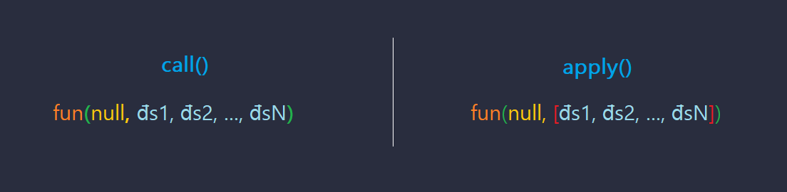
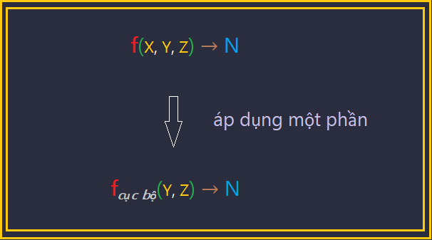
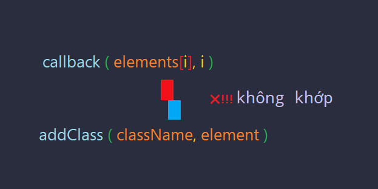

Giới thiệu về lập trình chức năng

Bài viết dựa trên bài viết [A Gentle Introduction to Functional JavaScript: Part 3](https://jrsinclair.com/articles/2016/gentle-introduction-to-functional-javascript-functions) của blogger James Sinclair nhằm mục đích học tập. Nếu thấy hữu ích bạn có thể theo dõi RSS của [tác giả](https://jrsinclair.com/index.rss)

Phần 3

Viết bởi James Sinclair ngày 6<sup>th</sup> tháng 2 năm 2016

Đây là phần ba trong 4 phần giới thiệu về lập trình ‘chức năng’ trong Javascript. Ở bài viết trước, chúng ta đã tìm hiểu về cách lập trình chức năng trên các mảng và danh sách. Ở bài viết này, chúng ta sẽ nghiên cứu về 1 loại hàm có tên là __higher-order__.

+ Phần 1: [Các khối xây dựng và động lực](https://medium.com/@vnknowledge/b%C3%A0i-d%E1%BB%8Bch-gi%E1%BB%9Bi-thi%E1%BB%87u-v%E1%BB%81-l%E1%BA%ADp-tr%C3%ACnh-ch%E1%BB%A9c-n%C4%83ng-7508808a39e5)
+ Phần 2: [Làm việc với mảng và danh sách](https://medium.com/@vnknowledge/gioi-thieu-ve-lap-trinh-chuc-nang-p2-2b496ffaf524)
+ Phần 3: Hàm để tạo hàm
+ Phần 4: Làm việc với phong cách (sắp được dịch)

# I. Hàm tạo hàm

Nhắc lại bài viết trước, chúng ta thực hiện tách một số câu lệnh sang các hàm đơn giản. Tiếp đó ta thay thế _vòng for_ thông thường vào trong hàm _map_ và _reduce_. Bài hôm nay sẽ bàn về các ‘_hàm tạo hàm_’, chúng là những công cụ giúp chúng ta viết code ngắn gọn, xúc tích hơn.

Hàm tạo hàm đôi khi còn được biết tới với tên gọi hàm **higher-order**. Để hiểu được chúng, chúng ta cần _‘ghé thăm’_ vài tính năng của Javascript cho phép nó tạo ra loại hàm này. Thảm khảo về [Higher-Order function ở Wiki ](https://en.wikipedia.org/wiki/Higher-order_function) để biết thêm.

# II. Các chất liệu tiếp theo trong lập trình hàm

\* Bài viết đầu tiên có nói tới 2 chất liệu chính là _biến_ và _hàm_.

## 1. Hàm Closure và phạm vi của biến

Một trong những phần khó nhằn trong Javascript là chỗ các biến mà một hàm có thể ‘thấy’. Giả sử ta khai báo biến _x_ bên trong một hàm, biến _x_ không thể được thấy bên ngoài hàm đó. Ví dụ:

```js
var thing = 'bat';

var sing = function() {
    // Bên trong ‘sing’ có thể thấy biến line
    var line = 'Twinkle, twinkle, little ' + thing;
    console.log(line);
};

sing();
// Twinkle, twinkle, little bat

// Bên ngoài ‘sing’, chúng ta không thể thấy biến line
console.log(line);
// ⛔ Uncaught ReferenceError: line is not defined
```

Tuy nhiên, nếu ta định nghĩa một hàm ở trong một hàm khác, hàm bên trong có thể truy xuất tới biến ở hàm bên ngoài:

```js
var outer = function() {
    var outerVar = 'Hatter';
    var inner = function() {
         // Hàm trong ‘inner’ có thể thấy biến outerVar
         console.log(outerVar);
         // Hatter

         var innerVar = 'Dormouse';
         // 🌳🌳🦍🌄 phạm vi của innerVar là trong hàm inner, bên ngoài không thể thấy
    }

    // 🙈 a! innerVar đi đâu rồi nhỉ?
    return inner;
}

var f = outer();
f();
```

Có điểm bạn sẽ thấy là sau khi thực thi xong hàm _outer()_, biến _outerVar_ không bị mất đi. Nên khi gọi _f()_, chương trình log ra kết quả 'Hatter'. Đây là điểm đặc biệt của Javascript so với các ngôn ngữ khác. Bạn sẽ mất chút thời gian để làm quen với điều này. Nếu gặp khó khắn trong việc xác định các biến mà hàm có thể thấy. Đừng vội lo lắng, _tới nơi hàm được khai báo, ta hoàn toàn phát hiện ra các biến mà hàm đó thấy được._

## 2. Biến _‘arguments’_

Khi bạn tạo một hàm trong Javascript, nó sẽ tạo ra một biến đặc biệt tên là `arguments`. Cấu trúc của nó khá giống mảng. VD:

```js
var showArgs = function(a, b) {
    console.log(arguments);
}
showArgs('Tweedledee', 'Tweedledum');
//=> { '0': 'Tweedledee', '1': 'Tweedledum' } (🌟)
```

Quan sát kết quả, ta có nhận xét sau

▪ **arguments** là một đối tượng có tên khóa ứng với các chỉ mục của mảng như 0, 1,...

▪ Điểm nữa là __arguments__ chứa tất cả các đối số được sử dụng để gọi hàm, nó không bắt buộc phải ứng với tham số được quy định khi định nghĩa hàm. Bên dưới là ví dụ mà số lượng _tham số_ và _đối số_ là khác nhau:

```js
// đối số ít hơn tham số
showArgs('less');
//=> { 0: "less" }

// đối số nhiều hơn tham số
showArgs('a', 'l', 'i', 'c', 'e');
//=> { '0': 'a', '1': 'l', '2': 'i', '3': 'c', '4': 'e' }
```

▪ Biến __arguments__ cũng có thuộc tính ‘_length_’ giống mảng:

```js
var argsLen = function() {
    console.log(arguments.length);
}
argsLen('a', 'l', 'i', 'c', 'e');
//=> 5
```

## 3. Call và Apply

Như ta biết trước đó, các mảng có sẵn các phương thức chả hạn như _.map_ và _.reduce_. Ở chiều tương tự, các hàm cũng được cung cấp cho một vài phương thức.

Thông thường chúng ta gọi hàm bằng cách sử dụng một cặp ngoặc tròn và truyền vào các đối số:

```js
function twinkleTwinkle(thing) {
    console.log('Twinkle, twinkle, little ' + thing);
}
twinkleTwinkle('bat');
//=> Twinkle, twinkle, little bat
```

Một cách khác để gọi hàm là sử dụng phương thức __call__:

```js
twinkleTwinkle.call(null, 'star');
//=> Twinkle, twinkle, little star
```

Đối số đầu tiên thể hiện giá trị của `this` mà ta có thể sử dụng ở phần thân hàm, hiện tại ta không cần quan tâm. Các đối số thứ 2 trở đi sẽ được truyền lần lượt tới hàm.

Phương thức __apply__ có chức năng khá tương đồng với __call__. Khác nhau cơ bản là __call__ nhận một danh sách các đối số, trong khi __apply__ nhận một mảng các đối số ở tham số thứ hai:



Ví dụ:

```js
twinkleTwinkle.apply(null, ['bat']);
//=> Twinkle, twinkle, little bat
```

Cả hai phương thức này đều được sử dụng khi chúng ta xây dựng lên các ‘_hàm tạo hàm_’.

## 4. Hàm nặc danh
Một hàm nặc danh (cũng được biết tới với tên gọi _biểu thức lambda_) là một hàm được định nghĩa nhưng không có tên. Các hàm nặc danh thường được sử dụng với __map__ và __reduce__:

```js
var numbers = [1, 2, 3];
var doubledArray = map(function(x) { return x * 2}, numbers);
console.log(doubledArray);
//=> [ 2, 4, 6 ]
```

# III. Áp dụng một phần

▪ Trong khoa học máy tính áp dụng một phần (tên khác là ‘hàm áp dụng một phần’ hay ‘hàm cục bộ’) là nói tới việc cố định một số lượng đối số cho một hàm, tạo ra một hàm mới với số lượng đối số nhỏ hơn. Cho hàm _f_, Ta có thể cố định - **fix / bind** đối số thứ nhất, tạo ra hàm cục bộ:



▪ Ví dụ, ta tạo ra hàm **addClass()** nhận vào một tên class và một thẻ DOM:

```js
var addClass = function(className, element) {
    element.className += ' ' + className;
    return element;
}
```

Chúng ta muốn sử dụng hàm này với __map__ để thêm class vào các thẻ DOM.

```js
var map = function(callback, array) {
    var newArray = [];
    for (var i = 0; i < array.length; i = i + 1) {
        newArray[i] = callback(array[i], i);
    }
    return newArray;
}
```

Kết hợp _map_ và _addClass_:

```js
var ids = ['DEE', 'DUM'];

// (chưa cần hiểu bind vội) Mục đích là để thu được các thẻ DOM có id là “DEE”, “DUM”
var elements = map(document.getElementById.bind(document), ids);

// thêm tên class cho các thẻ DOM thu được
map(addClass, elements);
```

▪ Tuy nhiên, chương trình trên sẽ không thực thi thành công bởi một vấn đề: bên trong _map_, ta truyền từng phần tử DOM tới tham số thứ nhất của _callback_, dẫn tới gọi _callback_ sẽ không khớp với _addClass_. Cho hình dưới để bạn tiện so sánh:



Giải pháp là tạo một hàm mới, trong đó gọi tới _addClass_, đồng thời ‘fix-cứng’ tên class chúng ta muốn:

```js
var addTweedleClass = function(el) {
    return addClass('tweedle', el);
}
```

Giờ chúng ta có một hàm chỉ nhận 1 tham số. Nó phù hợp để có thể truyền tới _map_:

```js
var ids = ['DEE', 'DUM'];
var elements = map(document.getElementById.bind(document), ids);
elements = map(addTweedleClass, elements);  // 🌟
```

▪ Nhưng nếu muốn thêm tên một class khác, đòi hỏi phải tạo thêm một hàm nữa:

```js
var addBoyClass = function(el) {
    return addClass('boy', el);
}
```

🤔 có gì đó đang lặp lại!! - Lúc nãy sẽ thật tuyệt nếu ta có một hàm chuyên để cố định tham số đầu tiên:

```js
var partialFirstOfTwo = function(fn, param1) {
    return function(param2) {
        return fn(param1, param2);
    }
}
```

Chú ý câu lệnh `return` đầu tiên. Chúng ta đang tạo một hàm mà trả về một hàm khác.

```js
var addTweedleClass = partialFirstOfTwo(addClass, 'tweedle');
var addBoyClass = partialFirstOfTwo(addClass, 'boy');

var ids = ['DEE', 'DUM'];
var elements = map(document.getElementById.bind(document), ids);
elements = map(addTweedleClass, elements);
elements = map(addBoyClass, elements);
```

▪ Có vẻ **partialFirstOfTwo** hoạt động khá ổn với hàm nhận chính xác 2 tham số. Nhưng làm thế nào để _‘áp dụng một phần’_ với hàm nhận 3 tham số? Hay có thể là 4 hoặc hơn? Tóm lại là một hàm giúp fix-cứng cho nhiều hơn một tham số? Với yêu cầu này, chúng ta sẽ sử dụng phương thức _slice_ và _apply_ như sau:

```js
var argsToArray = function(args) {
    return Array.prototype.slice.call(args, 0);
}

var partial = function() {
    // chuyển đổi đối-tượng-giống-mảng sang một mảng mới
    var args = argsToArray(arguments);

    // shift() cho phép lấy ra phần tử đầu tiên của mảng. Trong trường hợp này phần tử đầu tiên là một hàm. args sẽ chứa các các đối số còn lại.
    var fn = args.shift();  // 🐘

    return function() {
        var remainingArgs = argsToArray(arguments);
        return fn.apply(this, args.concat(remainingArgs));  // 🐘 Gọi hàm fn
    }
}
```

Hiện tại, chúng ta chưa cần nắm rõ chi tiết hàm _partial_ hoạt động. Chỉ nên biết rằng, hàm này cho phép chúng ta _‘áp dụng một phần/fix-cứng’_ một số lượng đối số bất kì của hàm.

```js
var twinkle = function(noun, wonderAbout) {
    return 'Twinkle, twinkle, little ' +
        noun + '\nHow I wonder where you ' +
        wonderAbout;
}

// fix-cứng noun
var twinkleBat = partial(twinkle, 'bat');
twinkleBat('are at'); // Twinkle, twinkle, little bat\nHow I wonder where you are at

// fix-cứng noun và wonderAbout - áp dụng toàn phần/hard-coded!
var twinkleStar = partial(twinkle, 'star', 'are');
twinkleStar(); // Twinkle, twinkle, little star\nHow I wonder where you are
```

Javascript cung cấp sẵn cho các hàm một phương thức hoạt động tương tự _partial_ là _bind_. Vấn đề là nó mong chờ tham số đầu tiên phải là một đối tượng biến `this` tham chiếu tới. Ví dụ, nếu muốn _‘áp dụng một phần’_ tới `document.getElementById`, bạn phải truyền `document` ở tham số đầu tiên:

```js
var getWhiteRabbit = document.getElementById.bind(document, 'white-rabbit');
var rabbit = getWhiteRabbit();
```

Dẫu vậy, đa phần ta không phải sử dụng tới biến `this` (đặc biệt viết code theo cách lập trình chức năng), vì vậy ta chỉ cần đưa `null` vào tham số thứ nhất. VD:

```js
var twinkleBat = twinkle.bind(null, 'bat');
var twinkleStar = twinkle.bind(null, 'star', 'are');
```

Xem thêm về [.bind ở trang MDN](https://developer.mozilla.org/en/docs/Web/JavaScript/Reference/Global_objects/Function/bind)

## 1. tổng hợp hàm - composition

Như các bạn đã biết ở bài viết trước, lập trình chức năng là về lấy ra các hàm nhỏ, đơn giản, đặt chúng lại với nhau để giải quyết những vấn đề phức tạp hơn. Viết code theo kiểu này bao gồm nhiều kĩ thuật, như  _‘Áp dụng một phần’_ được nói bên trên. Một kĩ thuật khác có thể được sử dụng là _‘Tổng hợp hàm’_, nó giúp kết hợp các hàm lại với nhau.

▪ Dạng đơn giản nhất của _tổng hợp hàm_ gồm 2 hàm a và b, cả hai đều chỉ nhận 1 tham số. Tổng hợp chúng cho ra hàm c. Kết quả thu được từ b sẽ là đối số khi gọi a. Giá trị thu được từ a là kết quả của c: c(x) = a(b(x)). Ví dụ:

```js
var composeTwo = function(funA, funB) {
    return function(x) {
        return funA(funB(x));
    }
}

var nohow = function(sentence) {
    return sentence + ', nohow!';
}
var contrariwise = function(sentence) {
    return sentence + ' Contrariwise…';
}

var statement = 'Not nothin&amp;rsquo;';
var funC = composeTwo(contrariwise, nohow);
console.log(funC(statement));
//=> Not nothin&amp;rsquo;, nohow! Contrariwise…
```

Hàm composeTwo giúp kết hợp 2 hàm funA và funB ra funC. Tuy nhiên, chúng ta có thể muốn kết hợp nhiều hơn 2 hàm với nhau. Điều này đòi hỏi một hàm tổng hợp có tính khái quát hơn:

```js
var compose = function() {
    var args = arguments;
    var start = args.length - 1;
    return function() {
        var i = start;
        var result = args[start].apply(this, arguments);
        i = i - 1;
        while (i >= 0) {
            result = args[i].call(this, result);
            i = i - 1;
        }
        return result;
    };
};
```

Một lần nữa, gạt phần body của hàm **compose** sang một bên, hãy chú ý tới những gì mà nó làm được. Khi áp dụng vào ví dụ trên:

```js
var funC = compose(contrariwise, nohow);
```

Lợi ích của hàm tổng hợp sẽ rõ hơn khi chúng ta tìm hiểu về hàm _currying_ nói tới ở phần sau.

▪ Với một vài hàm tiện ích nhỏ, chúng ta có thể sử dụng _compose_ để làm cho code được rõ ràng, ngắn gọn. Ví dụ, ta có một bài thơ sau:

```js
var poem = 'Twas brillig, and the slithy toves\n' +
    'Did gyre and gimble in the wabe;\n' +
    'All mimsy were the borogoves,\n' +
    'And the mome raths outgrabe.';
```

\* brillig: Trong từ điển nghĩa là _4h chiều, là lúc mà bạn bắt đầu nướng (broiling) gì đó cho bữa tối._

Với định dạng như này, bài thơ sẽ không được hiển thị tốt lắm trên trình duyệt. Nó nên được định dạng theo chuẩn HTML. Trước hết chúng ta cần dịch từ ‘brillig’ sang một dạng dễ hiểu hơn cho người đọc. Sau đó ta đưa tất cả vào trong 2 thẻ HTML là `<p>` và `<blockquote>`. Hãy tạo 2 hàm đơn giản như sau:

```js
var replace = function(find, replacement, str) {
    return str.replace(find, replacement);
}

var wrapWith = function(tag, str) {
    return '<' + tag + '>' + str + '</' + tag + '>';
}

var addBreaks      = partial(replace, '\n', '<br/>\n');
var replaceBrillig = partial(replace, 'brillig', 'four o’clock in the afternoon');
var wrapP          = partial(wrapWith, 'p');
var wrapBlockquote = partial(wrapWith, 'blockquote');

var modifyPoem = compose(wrapBlockquote, wrapP, addBreaks, replaceBrillig);

console.log(modifyPoem(poem));
//=> <blockquote><p>Twas four o’clock in the afternoon, and the slithy toves<br/>
//   Did gyre and gimble in the wabe;<br/>
//   All mimsy were the borogoves,<br/>
//   And the mome raths outgrabe.</p></blockquote>
```

Chú ý nếu bạn đọc các đối sổ ở __compose__ từ trái sang phải, chúng sẽ được gọi theo thứ tự ngược lại. Các bạn có thể thấy một chút bối rối, bởi vậy, một số thư viện lập trình chức năng cung cấp các hàm thực thi theo chiều thuận tên là _pipe_ hay _flow_.

Sử dụng _pipe_, chúng ta có thể viết _modifyPoem_ như sau:

```js
var modifyPoem = pipe(replaceBrillig, addBreaks, wrapP, wrapBlockquote);
```

## 2. Currying

Giới hạn của _‘compose’_ là nó coi các hàm truyền vào đều chỉ nhận 1 tham số. Nó không phải vấn đề gì lớn vì ta đã có _‘partial’_, nó có thể chuyển đổi hàm nhiều tham số tới hàm một tham số. Tuy nhiên, _partial_ vẫn chưa đủ. Hàm curry có thể là một giải pháp, có thể coi là là phiên bản ‘_kích thích của partial_’.

Chi tiết của _currying_ có chút phức tạp. Trước tiên hãy xem một ví dụ. Chúng ta có hàm _formatName_ dùng để đặt tên người vào trong dấu chú thích. Nó có 3 tham số. Phiên bản được _curry-hóa_ (để dễ gọi tôi sẽ viết loại hàm này với tên là hàm cà-ri) của _formatName_ sẽ có ít hơn 3 tham số, nó có vài tham số được _‘áp dụng một phần’_:

```js
var formatName = function(firstname, surname, nickname) {
    return firstname + ' “' + nickname + '” ' + surname;
}
var formatNameCurried = curry(formatName);  // 🍛 cơm cà-ri

var james = formatNameCurried('James');  // ⚓ fix firstname

console.log(james('Sinclair', 'Mad Hatter'));  // 📞 gọi với surname, nickname
//=> James “Mad Hatter” Sinclair

var jamesS = james('Sinclair')  // ⚓ fix surname

console.log(jamesS('Dormouse'));  // 📞 gọi với nickname
//=> James “Dormouse” Sinclair

console.log(jamesS('Bandersnatch'));  // 📞 gọi với nickname
//=> James “Bandersnatch” Sinclair
```

Có vài thứ cần chú ý về hàm ‘cà-ri’:

```js
formatNameCurried('a');  // ‘formatName’ không được gọi, trả về hàm cà-ri
formatNameCurried('a')('b');  // ‘formatName’ không được gọi, trả về hàm cà-ri
formatNameCurried('a', 'b');  // ‘formatName’ không được gọi, trả về hàm cà-ri

formatNameCurried('a')('b')('c');  // ⇨ a “c” b
formatNameCurried('a', 'b', 'c');  // ⇨ a “c” b
formatNameCurried('a', 'b')('c');  // ⇨ a “c” b
formatNameCurried('a')('b', 'c');  // ⇨ a “c” b
```

Đây là code để bạn tiện so sánh giữa [currying](formatNameCurried.html) và [partial](formatNamePartial.html).

Nó vẫn chưa thể hiện lợi ích gì hơn so với ‘_partial_’. Nhưng currying sẽ trở nên vô cùng hữu dụng khi đi cùng hàm tổng hợp.

Quay lại ví dụ bài thơ phía trên, sẽ thế nào nếu ta muốn đưa câu ‘_four o’clock in the afternoon_’ vào trong thẻ `<em>`?

```js
var replace = curry(function(find, replacement, str) {  // 🎭 
    var regex = new RegExp(find, 'g');
    return str.replace(regex, replacement);
});

var wrapWith = curry(function(tag, str) {  // 🎭
    return '<' + tag + '>' + str + '</' + tag + '>';
});

var modifyPoem = pipe(
    replace('brillig', wrapWith('em', 'four o’clock in the afternoon')),  // ⚓ fix thsố 1 & 2
    replace('\n', '<br/>\n'),  // ⚓ fix thsố 1 & 2
    wrapWith('p'),             // ⚓ fix thsố 1
    wrapWith('blockquote')     // ⚓ fix thsố 1
);

console.log(modifyPoem(poem));
//=> <blockquote><p>Twas <em>four o’clock in the afternoon</em>, and the slithy toves<br/>
//   Did gyre and gimble in the wabe;<br/>
//   All mimsy were the borogoves,<br/>
//   And the mome raths outgrabe.</p></blockquote>
```

Để ý, ta sử dụng hàm _pipe_ thay vì _compose_. Cũng không có hàm trung gian nữa, sử dụng hàm nặc danh (🎭). Khi gọi _pipe_ ta sẽ truyền vào các hàm ‘cà-ri’. Chúng cũng dễ đọc đấy chứ!

Đây là code để bạn tiện so sánh giữa [partial](formatNameCurryLodash.html) và [currying](formatNamePartialLodash.html) sử dụng thư viện Lodash. Tôi thay thế pipe bằng flow.

Bên dưới định nghĩa hàm _curry_ được điều chỉnh từ cuốn [JavaScript Allongé](https://leanpub.com/javascript-allonge). Một lần nữa, hãy tập trung vào ý nghĩa của hàm thay vì chi tiết bên trong.

```js
function curry (fn) {
    var arity = fn.length;

    function given (argsSoFar) {
        return function helper () {
            var args             = Array.prototype.slice.call(arguments, 0);
            var updatedArgsSoFar = argsSoFar.concat(args);

            if (updatedArgsSoFar.length >= arity) {
                return fn.apply(this, updatedArgsSoFar);
            }
            else {
                return given(updatedArgsSoFar);
            }
        }
    }

    return given([]);
}
```

## 3. Tại sao?

Vậy là ta đã đi tìm hiểu về những đặc điểm và ứng dụng của _partial_, _compose_, _pipe_ và _curry_. Chúng là những công cụ giúp ích trong việc lắp ghép các hàm nhỏ, đơn giản để giải quyết các vấn đề lớn hơn. Nhưng chúng có thực sự hữu ích? Chúng làm được điều gì khác so với trước đây? Quả thật, nó mở ra một phong cách mới cho việc viết code. Nó đưa ta nghĩ theo một con đường khác, có thể đơn giản hơn trong giải quyết các vấn đề. Nó cũng giúp giảm bug, dễ kiểm tra code được viết ra (Hãy thử và đánh giá nhé). Nếu bạn còn thấy hứng thú, xin mời đón đọc bài viết tới.