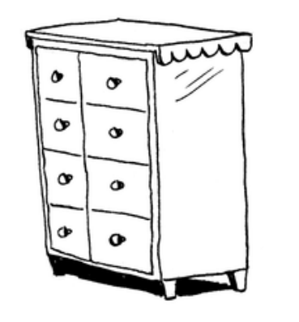

## Cách bộ nhớ hoạt động

Tưởng tượng bạn có một chiếc tủ kéo. Trong đó mỗi một ngăn kéo có thể chứa được 1 đồ vật.

Giờ nếu muốn cất đi 2 thứ, bạn sẽ phải mở 2 ngăn kéo khác nhau để có thể cất đồ.

Đây cơ bản cũng là cách bộ nhớ hoạt động. Chiếc máy tính giống như một chiếc tủ kéo có rất nhiều ngăn và mỗi ngăn có một địa chỉ.

Mỗi lần bạn muốn lưu một thứ tới bộ nhớ, bạn sẽ đi yêu cầu máy tính. Máy tính sẽ xử lí và gửi lại cho bạn địa chỉ nơi bạn có thể lưu trữ thứ đó. Nếu bạn muốn lưu nhiều thứ, sẽ có 2 cách cơ bản là: **array** và **linked list**. Sẽ không có một cách duy nhất để lưu trữ cho mọi trường hợp. Hiểu được sự khác nhau trong mỗi cách là rất quan trọng.

## Array và Linked Lists
Đôi khi bạn cần lưu trữ một danh sách các thứ vào bộ nhớ. Giả sử khi viết một chương trình *Todo List*. Bạn sẽ muốn lưu các việc cần làm vào trong bộ nhớ.

Bạn nên dùng **array** hay **linked list**? Trước tiên hãy thử lưu các việc cần làm vào một array. Khi dùng array, tất các các nhiệm vụ sẽ được lưu kế tiếp nhau trong bộ nhớ.

Giờ muốn thêm một việc nữa. Nhưng ngăn tủ tiếp theo bị chiếm bởi đồ vật của một ai đó.

Hay tượng tự, trường hợp lúc đi xem phim với bạn bè, ta sẽ cần tìm các ghế ngồi phải cạnh nhau, bỗng dưng có thêm một người bạn tới và muốn cùng đi xem. Không may là không có đủ ghế cho mọi người. Ta sẽ phải đổi sang một khu vực mới. Quay lại trường hợp Todo List, bạn sẽ yêu cầu máy tính cấp phát cho một vùng nhớ mà đáp ứng được 4 nhiệm vụ, tiếp theo, dời các nhiệm vụ sang đó.

Nếu có thêm một người bạn khác tới, vậy lại không có đủ ghế một lần nữa -- chúng ta phải đổi chỗ lần thứ hai. Vì vậy, việc thêm một phần tử vào mảng có thể rất phiền phức như trường hợp đi xem phim. Mỗi khi vùng nhớ chúng ta có không đủ và cần dời tới một vùng nhớ mới, việc thêm mới phần tử sẽ thực sự chậm. Một giải pháp là "giữ chỗ": dù chỉ có 3 việc cần làm, bạn có thể yêu cầu máy tính cấp cho một vùng nhớ đủ cho 10 việc. Khi đó bạn có thể thêm 10 việc mà không phải dời đi. Dẫu vậy, đây cũng chỉ là giải pháp tình thế bởi:

* Bạn có thể không dùng hết vùng nhớ và như vậy sẽ làm tốn bộ nhớ. Bạn không sử dụng nó, cũng như không ai có thể sử dụng.
* Bạn có thể thêm nhiều hơn 10 việc tới danh sách cần làm và một lần nữa phải dời vùng nhớ.

Đây chỉ là cách tam thời, không phải cách hoàn hảo. Linked list sẽ giải quyết vấn đề thêm các phần tử mà không lo việc phải dời đi.

## Linked List
Với Linked List, các việc cần làm có thể ở bất kì đâu trong bộ nhớ.

Mỗi phần tử sẽ chứa địa chỉ của phần tử tiếp theo. Một nhóm các địa chỉ bộ nhớ được liên kết với nhau.

Bạn tới địa chỉ đầu tiên và nó nói rằng, "Phần tử tiếp theo ở địa chỉ 123". Tới địa chỉ 123, được nói rằng, "Phần tử tiếp theo ở địa chỉ 847", và cứ như vậy. Thêm vào một phần tử vào linked list rất dễ dàng: chọn một ô nhớ ở bất kì đâu và lưu địa chỉ vào phần tử trước đó.

Với linked list, không còn việc phải dời vùng nhớ. Bạn cũng tránh được một vấn đề khác mà thỉnh thoảng xảy ra với array. Ví dụ bạn đang muốn tìm 10,000 ô nhớ cho một mảng. Bộ nhớ có 10,000 ô nhớ, nhưng đó không phải 10,000 ô nhớ đứng liên tiếp nhau. *Bạn chắc chắn không có vùng nhớ cho mảng này!* Với linked list, sẽ chỉ như nói "Hãy chia ra để xem".

Nếu linked list là tốt cho việc thêm mới, vậy array sẽ tốt cho việc gì?

## Array
Giả sử có trang web với một danh sách top-10 phim hay nhất nào đó sử dụng mưu mẹo để thu được nhiều lượt xem. Thay vì hiển thị danh sách trong 1 trang, họ hiển thị một phần tử trong 1 trang, người đọc sẽ phải click nút "Tiếp theo" để biết được phần tử tiếp theo là gì. Ở đây, tên 10 phim  sẽ không được hiển thị hết trong 1 trang. Thay vào đó là từ vị trí *#thứ 10* (Wrong hole), và ta phải click nút tiếp theo mỗi trang để tới được vị trí *#thứ 1* (Tit tit tit). Theo cách này, họ sẽ có 10 trang để hiển thị quảng cáo. Nhưng nó gây phiền cho người đọc vì phải click vào 1 nút 9 lần để biết bộ phim nào đứng đầu. Sẽ tốt hơn nếu tên 10 phim đó được hiển thị cùng lúc và click vào tên phim để xem thông tin của bộ phim đó.

Linked list có vấn đề tương tự. Giả sử bạn muốn thu được phần tử cuối cùng. Bạn không thể lấy ra ngay vì không biết địa chỉ của nó. Thay vào đó, bạn sẽ tới phần từ #1 để lấy địa chỉ của phần tử #2. Sau đó tới phần tử #2 để lấy địa chỉ của phần tử #3. Tiếp tục cho tới khi lấy được phần tử cuối cùng. Linked list tốt trong việc đọc tất cả phần tử lần lượt. Nhưng nếu muốn truy xuất ngẫu nhiên, linked list sẽ không cho tốc độ tốt.

Array thì khác. Bạn biết địa chỉ mọi phần tử trong mảng. Ví dụ có 1 mảng bao gồm 5 phần tử. Nếu biết được địa chỉ có phần tử #1 có địa chỉ 00, vậy địa chỉ của phần tử #5 là gi?

Với một phép tính đơn giản sẽ cho câu trả lời. Đó là 04. Array cho phép đọc ngẫu nhiên các phần tử, nhanh chóng lấy ra được phần tử bất kì tức thì. Trong linked list, phần từ không được đứng cạnh nhau, vì vậy bạn không tính toán được vị trí của phần tử thứ 5 trong bộ nhớ -- thay vào đó bắt đầu từ phần tử #1 để thu được địa chỉ phần tử #2, tiếp diễn để cuối cùng thu được phần tử thứ 5.

## Thuật ngữ
Các phần tử trong mảng được đánh giá. Bắt đầu từ 0 thay vì 1. Điều này thường làm bối rối cho người mới học lập trình. Phần lớn mọi ngôn ngữ lập trình sẽ đánh số các phần tử từ 0.

Vị trí của một phần tử được gọi *chỉ mục*. Thay vị nói "giá trị tại vị trí thứ nhất là 20", cách nói thuật ngữ là "giá trị tại *chỉ mục* thứ nhất là 20". Vị trí và chỉ mục là tương đương nhau.

### Thực hành ❓
2.1 Giả sử bạn đang xây dựng một ứng dụng chi tiêu.

Mỗi ngày, bạn sẽ lưu lại mọi thứ mà bạn bỏ tiền. Cuối tháng, bạn sẽ đánh giá mức chi tiêu. Như vậy, sẽ có rất nhiều lần thêm vào các loại chi tiêu và một ít việc đọc. Bạn nên sử dụng array hay linked list?

## Thêm vào giữa của một danh sách
Giả sử bạn muốn "Todo list" hoạt động giống với một cái lịch. Trước đó, chúng ta đang thêm vào nhiệm vụ mới tới cuối của danh sách.
Giờ các nhiệm vụ sẽ được sắp xếp theo thứ tự thời gian: cái nào cần được hoàn thành trước đứng trên.

Cái nào sẽ tốt hơn trong việc thêm mới phần tử vào giữa: array hay linked list? Với linked list, nó dễ dàng thay đổi địa chỉ của phần tử tiếp theo.

Trong khi với array, chúng ta phải dời toàn bộ các phần tử tới khu vực mới nếu không có đủ bộ nhớ. Linked list sẽ tốt hơn khi thêm mới phần tử vào giữa.

## Xóa phần tử
Với việc xóa một phần tử, linked list cũng làm tốt hơn array vì bạn chỉ cần thay đổi phần tử trỏ tới phần tử muốn xóa. Còn với array, sẽ cần dời các phần tử nếu muốn xóa một thứ gì.

Việc sử dụng array hay linked list sẽ tùy từng trường hợp. Ta thấy array rất phổ biến bởi chúng cho phép truy xuất ngẫu nhiên. Nghĩa là nếu muốn đọc phần tử thứ #10 trong array, ta có thể *nhảy ngay tới nó*. Còn Linked list chỉ có thể truy xuất tuần tự(\*2), đọc từng phần tử lần lượt. Để đọc phần tử thứ #10, ta đã phải đọc 9 phần tử đầu tiên. Vậy nên array là nhanh hơn trong việc đọc bởi khả năng truy xuất ngẫu nhiên. Rất nhiều trường hợp cần truy xuất ngẫu nhiên nên mảng được sử dụng rộng rãi. Array và Linked list còn được sử dụng để thực hiện các cấu trúc dữ liệu khác. Cái này sẽ được nói tới trong các bài sau.

\*1: random access 
\*2: sequentil access

## Thực hành ❓
2.2 Giả sử bạn đang chuẩn bị viết một app cho các nhà hàng để nhận yêu cầu của khách. App này sẽ lưu danh sách order. Người phục vụ sẽ thêm order tới danh sách, và đầu bếp sẽ nhận và nấu các món ăn. Hãy nghĩ nó như một hàng đợi. Người phục vụ thêm order vào cuối hàng, đầu bếp sẽ lấy ra order từ đầu hàng để thực hiện.

Bạn sẽ dùng một array hay linked list để thực hiện hàng đợi này
(Gợi ý: Linked list sẽ tốt ở mặt thêm vào/xóa đi. Trong khi array sẽ tốt cho truy xuất ngẫu nhiên. Cái nào bạn sẽ sử dụng?)

2.3 Giả sử Facebook có một danh sách các username. Khi có ai đó đăng nhập, việc kiểm tra được thực hiện. Nếu tên họ có trong danh sách, họ có thể đăng nhập. Mọi người thường xuyên đăng nhập vào Facebook, vì vậy sẽ có rất nhiều lần phải tìm kiếm trong danh sách. Ví dụ Facebook sử dụng tìm kiếm nhị phân(\*3) cho việc kiểm tra tài khoản. Tìm kiếm nhị phân cần truy xuất ngẫu nhiên -- để có thể truy xuất vào giữa của danh sách ngay tức thì. Như vậy, bạn sẽ dùng array hay linked list để thực thi danh sách này?

\*3 : binary search

2.4 Mọi người đăng ký Facebook cũng thường xuyên. Nếu như quyết định dùng mảng để lưu danh sách username. Điểm gì là bất lợi của mảng trong việc thêm mới? Cụ thể, nếu sử dụng tìm kiếm nhị phân cho việc đăng nhập. Sẽ ra sao khi thêm mới người dùng tới mảng?

2.5 Trong thực tế, Facebook không sử dụng array hay linked list để lưu thông tin người dùng. Hãy cân nhắc một cấu trúc lai (\*4): một array của các linked list. Bạn có một mảng 26 phần tử. Mỗi phần tử trỏ tới một linked list. Ví dụ, phần tử #0 trong array trỏ tới một linked list chứa các username bắt đầu chữ a. Phần tử #1 trỏ tới linked list chứa các username bắt đầu chữ b,...

\*4: hybrid data structure

Giả sử Adit B đăng ký Facebook. Bạn tới phần từ #0 trong array, rồi tới linked list và thêm Adit B vào cuối. Mặt khác, nếu muốn tìm kiếm cho Zakhir H. Bạn sẽ tới phần tử #26, nơi trỏ tới linked list chứa tất cả tên bắt đầu bằng chữ Z. Sau đó tìm kiếm thông qua linked list này.

So sánh cấu trúc lai này với array và linked list. Nó sẽ chậm hay nhanh hơn trong việc tìm kiếm và thêm mới? Bạn không phải đưa ra Big-O run times, chỉ đoán xem liệu cấu trúc này sẽ nhanh hay chậm hơn.