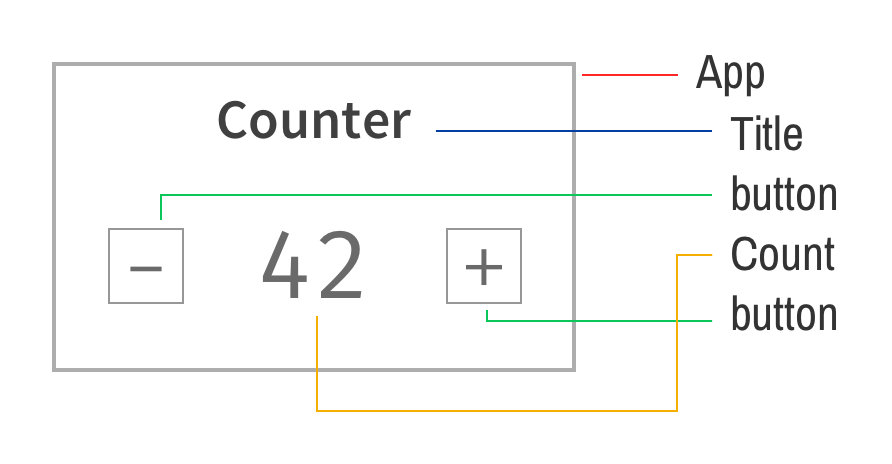
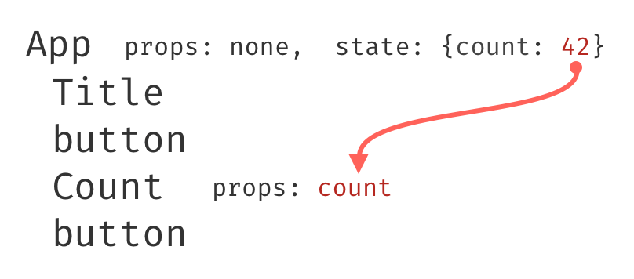
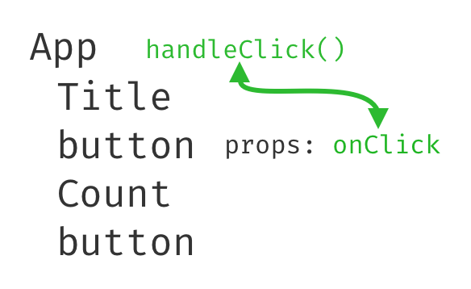
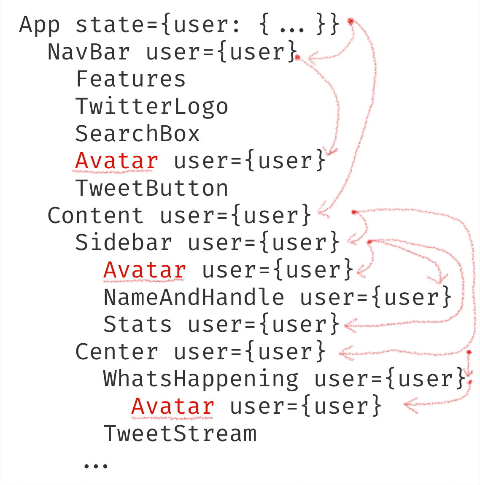
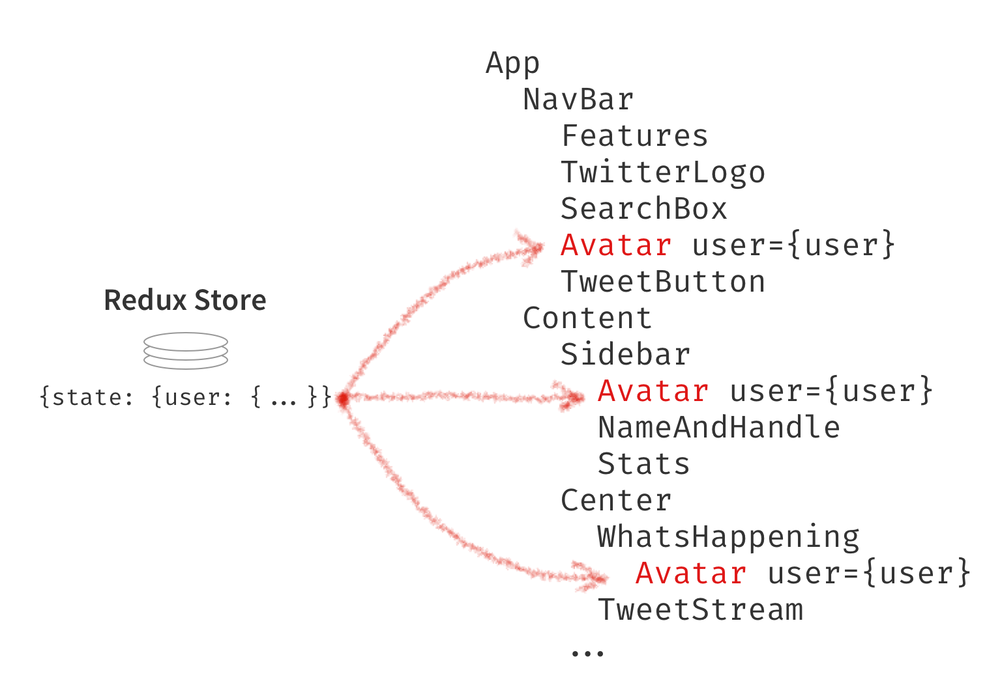

Trong quá trình tìm hiểu về Redux, tôi cảm thấy khó khăn để hiểu các khái niệm liên quan tới nó. Nếu bạn cũng đồng cảm như tôi, bài viết này có thể hữu ích với bạn!

Khi đọc xong bài viết này, bạn sẽ hiểu được Redux là như thế nào, và khi nào nên sử dụng nó cho ứng dụng của mình.

# Tại sao?
Câu hỏi để bắt đầu là: tại sao chúng ta nên sử dụng Redux?

Câu trả lời chắc chắn không phải là "Bởi vì mọi người trên mạng đang sử dụng nó." (Hiển nhiên là có rất nhiều người dùng Redux).

Redux có ích vì nó giải quyết vấn đề nào đó.

Nhưng thứ mà nó giải quyết không phải quản lí trạng thái. React THỰC HIỆN việc quản lí trạng thái. Redux góp phần vào quá trình đó, nhưng đó không phải gốc rễ vấn đề nó giải quyết. Nào chúng ta cùng đi tìm hiểu.

# Luồng dữ liệu
Nếu bạn đã từng sử dụng React, có thể bạn sẽ biết đến khái niệm `props` và cách dữ liệu được *lan truyền theo một chiều*. Một ứng dụng React là sự kết hợp của nhiều thành phần - component. Các thành phần tạo ra một hệ thống cây - component tree. Qua hệ thống cây này, dữ liệu được truyền xuống các thành phần bên dưới thông qua các thuộc tính - `prop`.

> Lưu ý: Trái ngược với cây cối thông thường, hệ thống cây ở đây có gốc rễ đứng cao nhất, trên cùng, còn phần ngọn là thấp nhất.


Một hệ thống các thành phần có thể giống như sau:



Trạng thái của `App`, có lưu giá trị `count`. Giá trị này sẽ truyền xuống cho thành phần con `Count`:



Để giữ liệu trở lên App, ta cần tới một hàm callback. Hàm callback này phải được truyền xuống cho thành phần con nào muốn đưa dữ liệu lên trên:



Đoạn code dưới mình họa việc truyền hàm callback tới button.

```jsx
class App extends React.Component {
  // ...
  handleClick = () => { /* ... */ }

  render() {
    return (
      // ...
      <button onClick={this.handleClick} />
      // ...
    );
  }
}
```

Chúng ta có thể coi dữ liệu giống như dòng điện ⚡, đi từ nguồn tới các thiết bị điện 💡. Dữ liệu đi từ trên xuống dưới và quay trở lại thông qua các dây dẫn. Tất nhiên dây dẫn không thể là không khí được - ta phải quy định cách mà dữ liệu kết nối giữa mỗi thành phần.

Đây là phần ôn lại React. Nếu bạn chưa làm quen react, hãy nên dừng lại. Thử viết vài ứng dụng nhỏ và quay lại bài viết này sau vài ngày. Nếu bạn không biết cách React hoạt động thì sẽ không hiểu được ý nghĩa của Redux.

# Luân chuyển dữ liệu qua các tầng

Bạn sẽ sớm bắt gặp tình huống muốn truyền dữ liệu từ thành phần gốc xuống cho các thành phần ở các tầng dưới. Ví dụ như các avatar ở Twitter:


Thành phần gốc `App` có trạng thái `user` chứa tiểu sử của một người dùng. Ta cần lấy ra dữ liệu từ `user` cho 3 thành phần Avatar. Để làm được việc này, `user` cần được truyền xuống các thành phần "con", tiếp tục xuống thành phần "cháu", rồi "chắt",... cứ như vậy cho tới thành phần Avatar. Các thành phần trung gian như con, cháu, chắt,... bản chất không dùng đến dữ liệu từ user.



Tóm lại, việc luân chuyển dữ liệu theo cách này rất phức tạp như thể đi luồn chỉ hết cây kim này sang cây kim khác.


Luồn một cây kim đã hại não, Không biết nhiều cái sẽ như nào? 💣💀💥

Đây chắc chắn không phải một thiết kế phần mềm tốt. Các thành phần trung gian phải chấp nhận và truyền vào `props` của những thành phần con, những dữ liệu mà chúng không quan tâm. Đồng nghĩa với làm khó việc tái cấu trúc và tái sử dụng các thành phần.

Có phải tuyệt vời hơn nếu ta ~~loại bỏ được các thành phần trung gian~~?. Thành phần nào không cần dữ liệu sẽ không phải thấy nó.

# Đặt dữ liệu vào thành phần bất kì

**Đây là vấn đề** mà Redux giải quyết. Cho phép các thành phần lấy trực tiếp dữ liệu mà nó muốn.

Sử dụng hàm `connect` mà Redux cung cấp, ta sẽ tạo sự liên kết giữa các thành phần với kho dữ liệu - data store. Qua đó, các thành phần có thể lấy về dữ liệu chúng cần mà không thông qua trung gian.



Nó cũng đưa ra một công cụ giúp debug dễ hơn là [Redux DevTools](https://github.com/gaearon/redux-devtools), sẵn có trên [Firefox](https://addons.mozilla.org/en-US/firefox/addon/remotedev/) và [Chrome](https://chrome.google.com/webstore/detail/redux-devtools/lmhkpmbekcpmknklioeibfkpmmfibljd), bao gồm các tính năng như kiểm tra sự thay đổi của state, time-travel debugging (quay trở lại trạng thái lúc trước và thấy ứng dụng trông ra sao trước đó).

Có thể nói, tác dụng chính của Redux là cho phép bất kì thành phần nào kết nối tới dữ liệu. Nếu bạn không cần điều này, có thể bạn không cần tới Redux.

## Component Avatar

Chúng ta sẽ thay đổi `Avatar` như sau:

```jsx
import React from 'react';
import { connect } from 'react-redux';

const Avatar = ({ user }) => (
  
);

const mapStateToProps = state => ({
  user: state.user
});

export { Avatar };
export default connect(mapStateToProps)(Avatar);
```

Bản thân các thành phần không biết tới Redux - Chúng chỉ sử dụng prop `user` và lấy giá trị *avatar* để dựng thẻ *img*. Cuối cùng, hàm *connect* sẽ cung cấp dữ liệu từ Redux tới cho Avatar thông qua **mapStateToProps**.

Bạn sẽ nhận thấy có 2 câu lệnh *export* ở cuối cùng - một cái mặc định, một cái sử dụng connect. Điều này là không bắt buộc, tuy nhiên sẽ hữu dụng nếu chúng ta có một bản thành phần mặc định và một bản "Redux hóa".

Chả hạn, bản mặc định được dùng khi viết kiểm thử - unit test, và tăng tính tái sử dụng. Hay một nơi nào trong ứng dụng có thể muốn dựng `Avatar` cho người dùng khác, thay vì bản thân người đăng nhập. Trong trường hợp này, bạn có thể `export` bản Redux hóa thành `CurrentUserAvatar` cho người đăng nhập, bản mặc định cho người dùng nói chung.

# Khi nào thì dùng Redux

Nếu bạn có một cấu trúc các thành phần như trên - dữ liệu được luân chuyển xuống nhiều tầng - hãy cân nhắc dùng Redux.

Nếu bạn cần lưu - cache dữ liệu giữa các view. Ví dụ, tải về dữ liệu khi người dùng click vào *trang chi tiết*, và lưu dữ liệu lại để lần sau vào lại trang đó nhanh hơn - cân nhắc dùng Redux.

Nếu ứng dụng đang lớn lên, quản lí nhiều dữ liệu - cân nhắc dùng Redux. *Nhưng*, tránh lạm dụng sử dụng nó, cân nhắc thêm nó vào khi thích hợp.

Bài viết sử dụng thông tin từ nguồn [daveceddia - What does redux do?](https://daveceddia.com/what-does-redux-do)