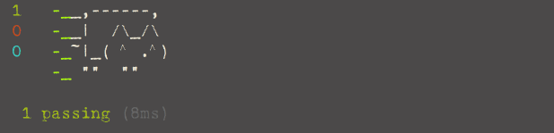
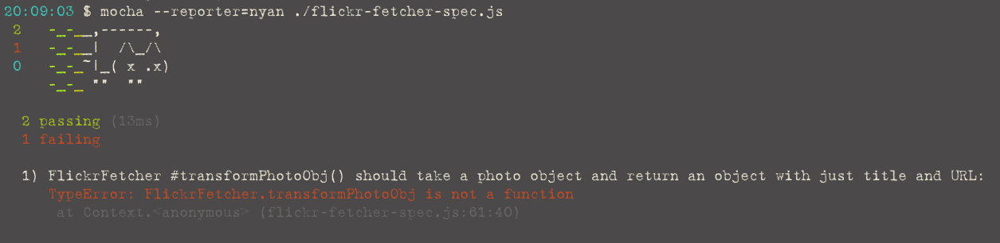
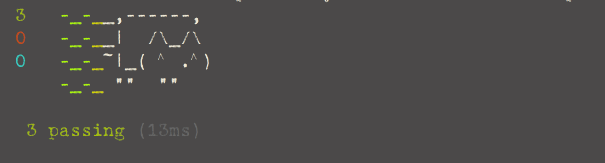
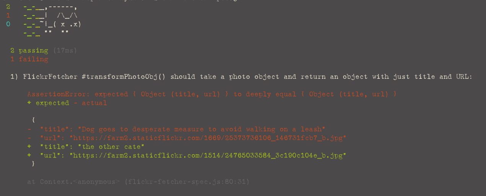

Đây là phần đầu trong ba phần từ kinh nghiệm cá nhân của tôi khi áp dụng TDD (\*) trong Javascript - Phát triển ứng dụng theo hướng kiểm thử. Trong loạt bài viết này, chúng ta sẽ cùng lần lượt đi qua các phần của một ứng dụng đầy đủ (nhỏ, đơn giản) gồm gửi các request qua mạng (còn biết đến là AJAX) và thao tác DOM:

+ Phần 1: Bắt đầu với các kiểm thử đơn vị - unit test
+ Phần 2: Gửi các request tới server thông qua TDD
+ Phần 3: Thao tác với DOM thông qua TDD

\* TDD: Test Driven Development

# I. Tại sao cần TDD?

Bắt đầu học về TDD có thể gây cho bạn cảm giác khó chịu, buồn tẻ và khó khăn. Từ ‘test’ dễ làm liên tưởng tới các bài thi, xì-chét, mấy người giám thị coi thi không được yêu quý cho lắm hoặc bất kì cảm giác bực tức nào đấy. Nó cho bạn thấy mình đang lãng phí thời gian cho những dòng code vô ích. Thêm một điểm nữa, có hàng vô số framework và các thư viện rối rắm ngoài kia. Một vài làm việc ở server, một vài làm việc ở trình duyệt, hoặc cho cả hai... đôi khi gây khó khăn cho những người mới lần đầu tiếp cận.

Các ý kiến phổ biển là “Viết test mất nhiều thời gian” hoặc “Làm sao tôi viết ra cái test đầu tiên khi chưa biết phải test cho cái gì” hay “Unit test có bắt hết mọi bug đâu” 🐞🐞🐞🐞

Tuy nhiên, cũng có nhiều lí do để bạn thử TDD:

1. Nó khiến tôi phải suy nghĩ. Nó đem lại nhiều điều hơn mà bạn chỉ mới thấy. Viết test thúc đẩy tôi nghĩ chi tiết, cụ thể về thứ tôi đang định thực hiện. Một khi mọi thứ trở nên rõ ràng, nó cũng khiến việc viết code trở nên dễ dàng hơn. Chừng nào tôi còn loay hoay với một bài test, có nghĩa là tôi chưa hiểu đầy đủ vấn đề mình đang đi giải quyết.

2. Nó làm việc debug (\*) dễ dàng hơn . Dù TDD không hoàn toàn khiến bạn viết ít bug hơn 😭, nhưng với mỗi trường hợp test thành công, nó làm bạn tin tưởng bởi bạn đã sửa được cái lỗi đó. Bạn cũng dễ tìm ra nguyên nhân của bug.

\*: công việc phát hiện và sửa lỗi

3. Nó làm việc viết code trở nên thú vị. Theo quan điểm của tôi, lí do này hơn hẳn so với hai lí do nếu trên. Tập luyện các bước đơn giản của TDD làm tôi thấy vui vẻ. Sự kỉ luật của TDD sẽ cần có thời gian để bạn làm quen, nhưng một khi cảm thấy hoàn hoàn thoải mái, bạn chợt nhận ra niềm vui trong đó.

Đây không phải là những lý do duy nhất để làm quen với TDD nhưng hi vọng các bạn sẽ thử một lần viết test. Pnần tới chúng ta sẽ đi tìm hiểu khái niệm cơ bản của TDD.

# II. TDD là gì?

TDD là một cách thức để viết phần mềm khi bạn sẽ viết mã test trước khi viết mã của ứng dụng. Các bước cơ bản gồm:

1. Đỏ: Viết test và đảm bảo nó kết quả test là không thành công
2. Xanh: Dùng cách đơn giản, dễ nhất để vượt qua trường hợp test.
3. Tái cấu trúc: Tối ưu và/hoặc làm đơn giản code của trương trình, đồng thời đảm bảo kết quả test vẫn thành công

Một khi kết thúc bước 3, chúng ta lại bắt đầu vòng đời mới cho một trường hợp test khác. Có thể nói quá trình này tạo nên kỉ luật trong TDD vì nó khuyến khích bạn:

1. Viết test
2. Viết ra chương trình được xây dựng từ các phần nhỏ và dễ hiểu.

Phần tới chúng ta sẽ có các ví dụ cho mỗi bước trên.

# III. Ví dụ

Hãy lấy một ví dụ hết sức cơ bản: lấy dữ liệu từ một server. Trong trường hợp này, ta cần lấy ra một danh sách các bức ảnh của trang Flickr.com, biến đổi nó về HTML và thêm vào trang web. Bạn có thể thấy [kết quả cuối cùng trên trang Codepen](http://codepen.io/jrsinclair/pen/EKQmwo)

Trong ví dụ này, chúng ta sẽ sử dụng freamwork [Mocha](http://mochajs.org). Tôi chọn Mocha không bởi nó là framework test phổ biến nhất; cũng không phải nó đồ sộ hơn so với các framework khác. Đơn giản nó có tùy chọn `--reporter=nyan` là một chú mèo khá ngộ nghĩnh:


# IV. Cài đặt

Ở bài viết này, chúng ta sẽ chạy các test Nodejs trên cái màn hình đen command line. Nếu bạn có thắc mắc, ‘Tại sao lại là Node? Ứng dụng web phải chạy hoàn toàn trên trình duyệt chứ’. Vâng, đúng vậy. Nhưng việc test được thực hiện trên Node vì nó có tốc độ nhanh hơn nhiều, và sự khác nhau giữa trình duyệt và Node sẽ giúp chúng ta suy nghĩ thật cẩn thận về cách để tổ chức code (Sẽ nói sau).

Để bắt đầu, chúng ta cần cài NodeJs, Mocha và một mô-đun tên là Chai. Nếu bạn đang sử dụng OS X, tôi khuyến cáo sử dụng Homebrew để cài Node để dễ dàng cập nhật các phiên bản mới. Bạn sử dụng câu lệnh sau ở terminal:

```terminal
$ brew install node
```

Nếu là trên Linux, chúng ta có thể sử dụng các chương trình quản lí các gói phần mềm như _apt-get_ hay _yum_ để cài Node.

Nếu sử dụng Windows, bạn có thể tới trang web chính thức của Nodejs và tải về bộ cài.

💡 _Một cách khác là sử dụng một chương trình chuyên quản lí Nodejs như [NVS](https://github.com/jasongin/nvs). Nó giúp bạn cài trên máy nhiều phiên bản Nodejs khác nhau và nó có mặt trên cả 3 hệ điều hành kể trên._

Một khi Node đã ở trong máy, chúng ta có thể sử dụng chương trình quản lí các gói thư viện Node là NPM để cài Mocha và Chai:

```terminal
mkdir get_start_with_tdd
cd ./get_start_with_tdd
npm install mocha -g
npm install chai
```

Giờ chúng ta đã thiết lập xong các chương trình cần có, tiếp theo ta có thể nghĩ về chương trình mình muốn xây dựng.

# V. Suy nghĩ

Trước khi viết một trường hợp test, bạn sẽ phải có tối thiểu một ý tưởng để thực hiện, cũng như cách để tổ chức code. Đầu tiên, hay mô tả chi tiết hơn về những gì chúng ta sẽ thực hiện:

1. Gửi một request tới Flickr API để lấy về một loạt các dữ liệu ảnh.
2. Biến đổi dữ liệu thu được vào trong một mảng các đối tượng, mỗi đối tượng chỉ chứa dữ liệu chúng ta cần.
3. Chuyển đổi mảng các đối tượng sang một thẻ HTML `<ul>` chứa các thẻ `<li>` bên trong.
4. Thêm thẻ `<ul>` vào trang.

Tiếp theo là cách tổ chức code. Đơn giản ta có thể đặt mọi thứ vào một mô-đun. Nhưng tôi có một vài lựa chọn mà tôi có thể thực hiện ở hai bước cuối như đã nói bên trên:

+ Tôi có thể thay đổi DOM trực tiếp để thêm thẻ `<ul>` vào trang sử dụng các phương thức DOM được các trình duyệt cung cấp (như `document.createElement()`, `document.createTextNode()`, `document.getElementById()`,...).
+ Tôi có thể sử dụng jQuery để thêm HTML vào trong trang.
+ Tôi có thể sử dụng framework như React.js hoặc Backbone View.

Trong bài này tôi chọn jQuery để tạo các HTTP request tới server, và nó cũng giúp thao tác với DOM. Tuy nhiên, trong tương lại, tôi có thể chuyển sang sử dụng React. Vì vậy, sẽ hợp lí để giữ tách việc **lấy và biến đổi dữ liệu** khỏi việc **tạo thẻ HTML và thêm vào DOM**. Như vậy, tôi cần tới hai mô-đun: một cho việc lấy dữ liệu, biến đổi nó; một cho việc quản lí HTML.

Điều này giúp tôi hình dung là sẽ cần tạo bốn file:

1. flickr-fetcher.js cho mô-đun 1 để lấy về dữ liệu và biến đổi nó.
2. photo-lister.js cho mô-đun 2 để nhận một danh sách, chuyển đổi nó về HTML, sau đó thêm vào trang. 
3. flickr-fetcher-spec.js chứa code để test file flickr-fetcher.js
4. photo-lister-spec.js chứa code để test file photo-lister.js

# VI. Viết các test

Với các file vừa tạo bên trên, giờ là thời điểm để viết ra trường hợp test đầu tiên. Điều đơn giản nhất để test lúc này là liệu tôi có thể nạp được mô-đun 1 hay không. File **flick-fetcher-spec** sẽ như sau:

```js
// flickr-fetcher-spec.js
'use strict';
var expect = require('chai').expect;

describe('FlickrFetcher', function() {
    it('should exist', function() {
        var FlickrFetcher = require('./flickr-fetcher.js');
        expect(FlickrFetcher).to.not.be.undefined;
    });
});
```

Các bạn có thể thấy, các cái test này chạy trên NodeJs, điều đó có nghĩa chúng ta sẽ nạp vào các mô-đun sử dụng phương thức `require()`.

Điểm thứ hai là chúng ta đang viết code theo kiểu BDD (\*). Đây là một biến thể của TDD, chứa các test được viết theo dạng: ‘_Mô tả [sự vật A]. Nó phải [thực hiện hành động XYZ]_’ (\*\*). Ở đây, [sự vật A] có thể là một _mô-đun_, hay một _class_, một _phương thức_, hay một _hàm_. Mocha cung cấp hàm _describe()_ và _it()_ để viết code theo dạng này.

\*: Behaviour Driven Development  
\*\*: Describe [thing]. It should [do something]

Tôi sẽ gọi phần _describe()_ là trường hợp test, phần _it()_ là bài test cho một trường hợp.

Điểm thứ ba ta thấy là chuỗi các hàm _expect().abc.def.ghj()_ để thực hiện việc kiểm tra. Trong trường hợp này, tôi muốn chắc chắn rằng mô-đun của mình không phải **undefined**. Cơ bản dạng thức này sẽ trông như sau:

```js
expect(giá_trị_thực_tế).to.equal(giá_trị_mong_muốn);
```

Giờ hãy thực thi chương trình test:

```terminal
mocha --reporter=nyan flickr-fetcher-spec.js
```

Kết quả test sẽ thành công, tôi sẽ thấy một chú mèo vui vẻ như bên dưới:




Test thành công. Hơi hài là chúng ta vẫn chưa viết ra bất kì một mô-đun nào. Cái file _flickr-fetcher.js_ hoàn toàn trống trơn. Nguyên nhân là NodeJs sẽ trả về một đối tượng rỗng nếu bạn **require** tới một file trắng, nên *FlickrFetcher* sẽ không phải _undefined_.

Tôi có một qui tắc cho bạn: “Không viết code cho mô-đun cho tới khi nào ta có một test hỏng”. 

Vậy là test đầu tiên thành công. Tiếp theo tôi cần viết một cái test khác. Hi vọng đó sẽ là test hỏng để tôi có thể code cho phần mô-đun.

Hai thứ trước hết tôi muốn thực hiện là:

1. Lấy về dữ liều từ trang Flickr.
2. Sau đó, biến đổi dữ liệu.

Lấy dữ liệu từ Flickr liên quan tới việc gửi request tới server, tôi sẽ nói tới nó ở bài viết sau. Thay vào đó, hãy tập trung vào việc biến đổi dữ liệu.

Tôi muốn biến đổi mỗi đối tượng ảnh mà Flickr gửi về sang một đối tượng bao gồm thuộc tính ‘tiêu đề’ và ‘url’. Trong đó Url sẽ đòi hỏi thêm một chút việc phải làm vì Flickr API không trả về đầy đủ Url. Tôi sẽ phải [xây dựng Url dựa trên kích thước của bức ảnh mình muốn](https://www.flickr.com/services/api/misc.urls.html). Giờ nó là lúc để viết cho một trường hợp test tiếp theo: một đơn vi nhỏ, hình thành nên từng phần của chương trình:

```js
// flickr-fetcher-spec.js
var FlickrFetcher = require('./flickr-fetcher.js');

describe('#photoObjToURL()', function() {
    it('should take a photo object from Flickr and return a string', function() {
        var input = {
            id:       '24770505034',
            owner:    '97248275@N03',
            secret:   '31a9986429',
            server:   '1577',
            farm:     2,
            title:    '20160229090898',
            ispublic: 1,
            isfriend: 0,
            isfamily: 0
        };
        var expected = 'https://farm2.staticflickr.com/1577/24770505034_31a9986429_b.jpg';
        var actual = FlickrFetcher.photoObjToURL(input);
        expect(actual).to.eql(expected);
    });
});
```

Chú ý: Tôi sử dụng **expect(actual).to.eql(expected);** mà không phải **expect(actual).to.equal(expected);**. Bởi nó sẽ kiểm tra từng giá trị bên trong _actual_ và _expect_, xem chúng có giống nhau hay không. Qui tắc bạn cần nhớ là, sử dụng _equal_ khi muốn so sánh số, chuỗi hay boolean, và _eql_ khi so sánh mảng hay đối tượng.

Giờ thực thi chương trình test lần nữa và ... lại là một chú mèo buồn. Oh Yeah! Nó là tín hiệu mừng, đó là lúc tôi viết code chương trình. Bước một đơn giản là tổ chức mô-đun như sau:

```js
// flickr-fetcher.js
var FlickrFetcher;

FlickrFetcher = {
    photoObjToURL: function() {}
};

module.exports = FlickrFetcher;
```

Thử thực thi chương trình test, chú mèo vẫn buồn (đỏ), lần này nó hiện lỗi `⛔AssertionError: expected undefined to deeply equal 'https://farm2.staticflickr.com/1577/24770505034_31a9986429_b.jpg'`. Hiển nhiên _undefined_ với một chuỗi không thể bằng nhau được rồi. Câu hỏi được đặt ra: “Cách nào đơn giản nhất có thể vượt qua bài test?” Tôi chỉ cần trả lại đúng giá trị mong chờ:

```js
var FlickrFetcher;

FlickrFetcher = {
    photoObjToURL: function() {
        return 'https://farm2.staticflickr.com/1577/24770505034_31a9986429_b.jpg';
    }
};
```

Kết quả test thành công với hình ảnh chú mèo vui vẻ (xanh).

Bước tiếp theo là tái cấu trúc. Liệu có cách nào để làm cho hàm này hiệu quả hay ngắn gọn hơn? Tại thời điểm này tôi thấy là không cần thiết. Nhưng chúng ta đều biết hàm này hoàn toàn không có giá trị. Nếu truyền một đối tượng khác, nó sẽ không hoạt động như ý. Hãy thử thêm vào một đối tượng nữa:

```js
// flickr-fetcher-spec.js
describe('#photoObjToURL()', function() {
    it('should take a photo object from Flickr and return a string', function() {
        var input = {
            id:       '24770505034',
            owner:    '97248275@N03',
            secret:   '31a9986429',
            server:   '1577',
            farm:     2,
            title:    '20160229090898',
            ispublic: 1,
            isfriend: 0,
            isfamily: 0
        };
        var expected = 'https://farm2.staticflickr.com/1577/24770505034_31a9986429_b.jpg';
        var actual = FlickrFetcher.photoObjToURL(input);
        expect(actual).to.eql(expected);

        input = {
            id:       '24770504484',
            owner:    '97248275@N03',
            secret:   '69dd90d5dd',
            server:   '1451',
            farm:     2,
            title:    '20160229090903',
            ispublic: 1,
            isfriend: 0,
            isfamily: 0
        };
        expected = 'https://farm2.staticflickr.com/1451/24770504484_69dd90d5dd_b.jpg';
        actual = FlickrFetcher.photoObjToURL(input);
        expect(actual).to.eql(expected);
    });
});
```

Sau đó chạy chương trình test và ta lại có hình con mèo buồn.

Câu hỏi lại được đặt ra “Làm cách nào đơn giản nhất để vượt qua bài test?” Tôi có thể viết câu lệnh **if** cho đúng hai trường hợp, nhưng sẽ hợp lí hơn để viết code hoạt động với mọi đối tượng thay vì chỉ một vài đối tượng cụ thể:

```js
// flickr-fetcher.js
FlickrFetcher = {
    photoObjToURL: function(photoObj) {
        return 'https://farm' + photoObj.farm + '.staticflickr.com/' + photoObj.server + '/' + photoObj.id + '_' +
            photoObj.secret + '_b.jpg';
    }
};
```

Chương trình test sẽ thành công lần nữa.

Chuyển sang bước kế tiếp, tái cấu trúc. Code ở đây hoàn toàn đơn giản, trừ việc các dấu cộng không được đẹp lắm. Một cách để xử lí vấn đề này là sử dụng một thư viện template như Handlebars hay [một cái khác nhẹ hơn](http://mir.aculo.us/2011/03/09/little-helpers-a-tweet-sized-javascript-templating-engine). Hoặc một cách khác, tôi đặt tất cả các chuỗi vào trong một mảng, sử dụng **join()** để ghép chúng lại với nhau. Điểm cộng ở cách này là nó chạy sẽ nhanh hơn so với cách sử dụng toán tử cộng:

```js
FlickrFetcher = {
    photoObjToURL: function(photoObj) {
        return [ 'https://farm',
            photoObj.farm, '.staticflickr.com/', 
            photoObj.server, '/',
            photoObj.id, '_',
            photoObj.secret, '_b.jpg'
        ].join('');
    }
};
```

Chạy chương trình test, kết quả thành công, tôi biết chắc mọi thứ hoạt động tốt. Ta có thể chuyển sang test cho một thứ khác...

Tại thời điểm này, giả sử tôi muộn tạo một mô-đun để đăng lên [npm](https://www.npmjs.com), tôi sẽ phải đi viết test cho tất cả các trường hợp mà hàm này cần vượt qua. Ví dụ:

+ Điều gì xảy ra nếu có ai đó đưa vào một chuỗi thay vì một đối tượng?
+ Điều gì xảy ra nếu ai đó không đưa vào bất kì tham số nào?
+ Điều gì xảy ra nếu ai đó đưa vào một đối tượng không có thuộc tính như hàm mong muốn?
+ Điều gì xảy ra nếu ai đó đưa vào một đối tượng với tên thuộc là đúng nhưng giá trị lại không phải là chuỗi?

Đó là những câu hỏi để đặt ra để test, nhưng tôi sẽ không đi sâu ở đây. Các chương trình hoàn chỉnh mà bạn viết ra, như làm việc với credit-card, hay bất kì thứ nào hoạt động qua mạng sẽ đòi hỏi bạn bắt buộc phải trả lời cho những câu hỏi kiểu như vậy.

Chúng ta vừa cùng tìm hiểu về một chu kỳ đầy đủ trong quá trình test: đỏ, xanh, tái cấu trúc. Chuyển sang trường hợp test khác. Tôi muốn nhận được một danh sách các đối tượng ảnh từ Flickr, sau chuyển biến đổi nó sang một danh sách các đối tượng có cấu trúc mà mình mong muốn. Lúc này, nếu phải xử lí một danh sách nào đó, sẽ đòi hỏi loại thao tác liên quan tới [map](https://medium.com/@vnknowledge/gioi-thieu-ve-lap-trinh-chuc-nang-p2-2b496ffaf524#51df). Để đơn giản, tôi sẽ tạo một hàm để xử lí một phần tử trong danh sách. Đó là nguyên tắc của unit-test - chọn ra những đơn vị nhỏ, dễ dàng để test:

```js
// flickr-fetcher-spec.js
describe('#transformPhotoObj()', function() {
    it('should take a photo object and return an object with just title and URL', function() {
        var input = {
                id:       '25373736106',
                owner:    '99117316@N03',
                secret:   '146731fcb7',
                server:   '1669',
                farm:     2,
                title:    'Dog goes to desperate measure to avoid walking on a leash',
                ispublic: 1,
                isfriend: 0,
                isfamily: 0
            },
            expected = {
                title: 'Dog goes to desperate measure to avoid walking on a leash',
                url:   'https://farm2.staticflickr.com/1669/25373736106_146731fcb7_b.jpg'
            },
            actual = FlickrFetcher.transformPhotoObj(input);
        expect(actual).to.eql(expected);
    });
});
```

Chạy chương trình test, tôi nhận được lỗi hàm không tồn tại:



Giờ con mèo của tôi lại buồn, cách gì đơn giản nhất để làm nó vui vẻ trở lại? Vẫn như cũ, tạo một hàm trả chính xác kết quả mà bài test mong muốn:

```js
transformPhotoObj: function() {
    return {
        title: 'Dog goes to desperate measure to avoid walking on a leash',
        url:   'https://farm2.staticflickr.com/1669/25373736106_146731fcb7_b.jpg'
    };
}
```

Chạy lại chương trình test, xuất hiện con mèo hạnh phúc.



Tôi có cần tái cấu trúc đoạn code này hay code trong toàn bộ chương trình? Lúc này có lẽ chưa cần. Nhưng mà đoạn code này chỉ làm việc với một đầu vào cụ thể, vì vậy ta hãy thử viết thêm một bài test khác:

```js
describe('#transformPhotoObj()', function() {
    it('should take a photo object and return an object with just title and URL', function() {
        var input = {
                id:       '25373736106',
                owner:    '99117316@N03',
                secret:   '146731fcb7',
                server:   '1669',
                farm:     2,
                title:    'Dog goes to desperate measure to avoid walking on a leash',
                ispublic: 1,
                isfriend: 0,
                isfamily: 0
            },
            expected = {
                title: 'Dog goes to desperate measure to avoid walking on a leash',
                url:   'https://farm2.staticflickr.com/1669/25373736106_146731fcb7_b.jpg'
            },
            actual = FlickrFetcher.transformPhotoObj(input);
        expect(actual).to.eql(expected);

        input = {
            id:       '24765033584',
            owner:    '27294864@N02',
            secret:   '3c190c104e',
            server:   '1514',
            farm:     2,
            title:    'the other cate',
            ispublic: 1,
            isfriend: 0,
            isfamily: 0
        };
        expected = {
            title: 'the other cate',
            url:   'https://farm2.staticflickr.com/1514/24765033584_3c190c104e_b.jpg'
        }
        actual = FlickrFetcher.transformPhotoObj(input);
        expect(actual).to.eql(expected);
    });
});
```



Điều đơn giản nhất để test thành công là sử dụng hàm **photoObjToURL()** mà tôi tạo ra bên trên:

```js
// flickr-fetcher.js
//… lược bớt cho ngắn gọn …
transformPhotoObj: function(photoObj) {
    return {
        title: photoObj.title,
        url:   FlickrFetcher.photoObjToURL(photoObj)
    };
}
```

Chạy chương trình test và mọi trường hợp test đều qua.


Chuyển sang bước tái cấu trúc. Hàm này có thể được cải thiện thêm điều gì không? Có lẽ là không. Tuy nhiên, bạn hãy luôn đặt ra câu hỏi này mỗi lần ta đi tới bước này nhé. 🐳

Qua bài này bạn đã được làm quen về các bước cơ bản trong TDD: đỏ, xanh, tái cấu trúc cũng như cách chúng ta suy nghĩ và giải quyết những bài test đầu tiên. Những bài viết tiếp theo, chúng tôi sẽ nói về [cách để xử lí bất đồng bộ khi gửi request tới server](https://jrsinclair.com/articles/2016/gentle-introduction-to-javascript-tdd-ajax) và [cách để test khi làm việc với DOM ở môi trường không phải trình duyệt](https://jrsinclair.com/articles/2016/gentle-introduction-to-javascript-tdd-html-dom).

