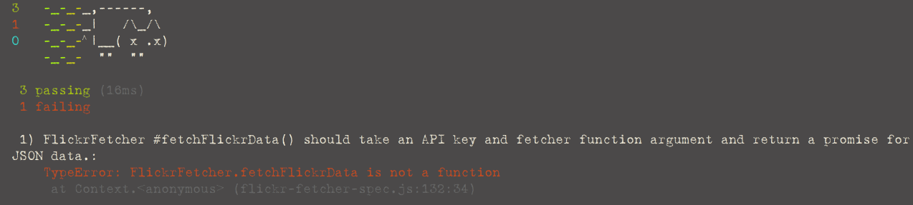

Đây là phần thứ hai trong ba phần giới thiệu về TDD trong Javascript. Ở bài viết trước, chúng ta bắt đầu xây dựng một ứng dụng web để lấy dữ liệu ảnh thông qua Flickr API và hiển thị lên page. Chúng ta đi xây dựng các mô-đun trong chương trình và viết unit test để đảm bảo mọi thứ sẽ hoạt động tốt. Trong bài này, chúng ta sẽ cũng tìm hiểu cách để test cho các phương thức bất đồng bộ khi cần gửi đi một request tới server (Điều này còn biết đến là AJAX).

+ Phần 1: [Bắt đầu với các kiểm thử đơn vị - unit test](https://medium.com/@vnknowledge/gi%E1%BB%9Bi-thi%E1%BB%87u-v%E1%BB%81-tdd-a845571cd6ec)
+ Phần 2: Gửi các request tới server thông qua TDD
+ Phần 3: Thao tác với DOM thông qua TDD

# I. Kiểm thử các phương thức bất đồng bộ khi gửi request

Ở bài viết trước, tôi đã hoãn việc viết kiểm thử cho những phần code được sử dụng để gọi Flickr API. Có thể nói việc kiểm thử đối với những phương thức làm việc với môi trường mạng đưa ra thêm một chút rắc rối trong việc test. Sau đây là ba thứ bạn sẽ cần được biết:

1. Kiểm tra một phương thức gọi tới API sẽ được thực hiện trong môi trường mạng.
2. Những phương thức như thế này đều là bất đồng bộ. Điều đó có nghĩa mỗi khi ta gửi đi một request, chúng ta sẽ làm gián đoạn tiến trình thông thường của chương trình.
3. Kết quả khi thực thi các phương thức trong môi trường mạng thường xuyên thay đổi. Nó khiến việc test trở nên khó khăn hơn.

▪ Tôi có thể nghĩ việc này không là vấn đề. Cứ tiến hành viết thử một bài test qua môi trường mạng và kiểm tra kết quả được trả về. Tuy nhiên điều này đem lại một số nhược điểm:

+ Dữ liệu lấy trực tiếp từ Flickr API luôn luôn thay đổi. Trừ phi phải thật tỉ mỉ, chính xác với mỗi bài test, còn không mọi bài test có thể được qua một cách dễ dàng nhưng một phút sau, bỗng phát hiện dữ liệu mới được trả về làm các bài test thất bại.
+ Vì phải thông qua môi trường mạng, việc kiểm thử có thể bị chậm lại, khi đó quá trình kiểm thử sẽ diễn ra sẽ không mấy dễ chịu cho lắm vì phải chờ đợi.
+ Nó hiển nhiên yêu cầu việc kết nối mạng. Trong khi tôi khá thường xuyên viết kiểm thử trong các điều kiện không được đảm bảo như trên xe buýt, tàu hỏa hay những nơi có wifi kém.

Điều này đòi hỏi tôi có sự cân nhắc chính xác về những gì mình muốn test. Tôi sẽ tạo ra một phương thức tên là **fetchFlickrData()** để lấy dữ liệu mà Flickr API trả về. Theo yêu cầu này, tôi cần đến một api để có thể tạo một request. API đơn giản nhất có thể dùng là phương thức **getJSON()** có trong jQuery. **getJSON()** nhận một URL và trả về Promise cho dữ liệu JSON (Nếu chưa biết về Promise, bạn hãy bỏ thêm chút thời gian tìm hiểu khái niệm cơ bản về nó).

Để xử lí mọi thứ gọn gàng, tôi cần nghĩ như theo kiểu lập trình chức năng. Thực hiện qua môi trường mạng tạo ra thêm tác dụng phụ, khiến hàm trở nên ‘dơ’ (🐘). Nhưng, nếu có thể cách li phần dơ này (tức phương thức **getJSON()**), thì tôi sẽ có được một hàm ‘sạch’, dễ dàng test. Nói cách khác, tôi đưa **getJSON()** ra một tham số cho hàm của mình:

🐘Thuật ngữ : #impure\_function vs #pure\_function

📚 Hàm sạch là những hàm thỏa mãn 2 điều kiện:

+ Truyền vào hàm đối số giống nhau luôn cho ra cùng một kết quả. Như vậy kết quả chỉ phụ thuộc vào các đối số.
+ Gọi hàm không tạo ra bất kì hiệu ứng phụ nào như
không gửi request qua mạng, không đọc hay viết file, không truy vấn cơ sở dữ liệu, không thay đổi các thẻ DOM, không thay đổi biến toàn cục, không hiển thị ở màn hình console.

```js
fetchFlickrData: function(apiKey, fetch) {

    // ...
}
``` 

Ở phần code ứng dụng, tôi sẽ dùng **$.getJSON** để ứng với tham số **fetch**. Trong khi đó, ở phần code test, tôi thay thế **$.getJSON** bằng cách đưa vào một phương thức **getJSON() giả**. Đặc điểm của phương thức giả này là nó luôn trả về một promise cho cùng một dữ liệu. Nhớ đó, **không cần tới môi trường mạng** tôi cũng có thể biết liệu hàm mình viết ra có cho kết quả như mong muốn.

▪ Vấn đề khác khi thực hiện các request trong Javascript là cơ chế bất đồng bộ. Bằng cách nào đó chúng ta cần thông báo cho chương trình test (Mocha) biết để chờ cho đến khi tất cả các test được hoàn thành. Mocha chung cấp một tham số cho callback của hàm **it()** có tên là **done** để thông báo rằng bài test đó đã được kết thúc.

Như vậy, tôi sẽ viết một bài test như sau:

```js
// flickr-fetcher-spec.js
describe("#fetchFlickrData()", function() {
  it("should take an API key and fetcher function argument and return a promise for JSON data.", function(done) {
    var apiKey = "does not matter much what this is right now",
      fakeData = {
        photos: {
          page: 1,
          pages: 2872,
          perpage: 100,
          total: "287170",
          photo: [
            {
              id: "24770505034",
              owner: "97248275@N03",
              secret: "31a9986429",
              server: "1577",
              farm: 2,
              title: "20160229090898",
              ispublic: 1,
              isfriend: 0,
              isfamily: 0,
            },
            {
              id: "24770504484",
              owner: "97248275@N03",
              secret: "69dd90d5dd",
              server: "1451",
              farm: 2,
              title: "20160229090903",
              ispublic: 1,
              isfriend: 0,
              isfamily: 0,
            },
          ],
        },
      },
      fakeFetcher = function(url) {
        var expectedURL =
          "https://api.flickr.com/services/rest/?method=flickr.photos.search&api_key=" +
          apiKey +
          "&text=pugs&format=json&nojsoncallback=1";
        expect(url).to.equal(expectedURL);  // 🍦
        return Promise.resolve(fakeData);
      };
    FlickrFetcher.fetchFlickrData(apiKey, fakeFetcher).then(function(actual) {
      expect(actual).to.eql(fakeData);  // 🍖
      done();
    });
  });
});
```

Để ý sẽ thấy tôi để câu lệnh **expect()** bên trong hàm fetch giả (chỗ 🍦). Điều này nhằm kiểm tra liệu chúng ta có gọi đúng URL. Đây là kết quả khi chạy chương trình test:



# II. Stub

Giờ tôi sẽ giải thích những gì đang diễn ra. Phương thức **fakeFetcher()** được dùng để thay thế **$.getJSON()** được biết tới là một **stub** (🌴). Một stub là phần code có cùng API và hành vi như phần code ‘thật’, nhưng chức năng hạn chế. Đồng nghĩa với giá trị mà nó trả về là dữ liệu cố định, thay vì có sự tương tác với những tài nguyên bên ngoài.

_🌴: để ngắn gọn stub ko được dịch và về ý nghĩa nó cũng biểu thị cho một thứ gì đó thật nhỏ, thật ngắn._

Ngoài việc để thay thế khi làm việc ở môi trường mạng, các stub có được sử dụng cho nhiều phần code khác. Chúng ta thường sử dụng chúng nhằm tránh những thứ mà trong lập trình chức năng gọi là tác dụng phụ. Stub có thể thay thế một vài thứ sau:

+ Truy vấn tới cơ sở dữ liệu quan hệ.
+ Tương tác với file hệ thống.
+ Nhận dữ liệu nhập vào từ người dùng.
+ Các công việc tính toán phức tạp đòi hỏi thời gian dài để xử lí.

Các stub không nên được hiểu là sự thay thế cho những thứ bất đồng bộ hay xử lí chậm. Nó đơn giản là phần code mà bạn chưa viết tới. Một stub có thể thay thế mọi thứ.

Các stub là một công cụ quan trong trong TDD. Chúng giúp việc kiểm thử diễn ra nhanh chóng, không làm chậm tiến trình công việc. Hơn hết, chúng tạo sự nhất quán khi việc kiểm thử có liên quan tới những thứ hay thay đổi như gửi request trong môi trường mạng.

---

Quay lại với ứng dụng web, khi chạy chương trình test, tôi nhận được lỗi. Để ý chỗ gần hai câu lệnh **expect()**, chỗ 🍦 trả về một promise, chỗ 🍖 trả về dữ liệu. Vì vậy tôi sẽ phải gọi hàm `fetch` để thu được promise, rồi dùng hàm `then` trả về dữ liệu. Tôi viết như sau:

```js
// flickr-fetcher
fetchFlickrData: function(apiKey, fetch) {
    var url = 'https://api.flickr.com/services/rest/?method=flickr.photos.search&api_key='
            + apiKey + '&text=pugs&format=json&nojsoncallback=1'
    return fetch(url).then(function(data) {
        return data;
    });
}
```

Kiểm tra lại và mọi thứ đều qua. Tôi chuyển sang bước tái cấu trúc.

Có hai thứ cần thay đổi ở đây. Thứ nhất, không cần sử dụng câu lệnh **then()** trong phương thức **fetchFlickrData()**, nên hãy xóa nó đi:

```js
fetchFlickrData: function(apiKey, fetch) {
    var url = 'https://api.flickr.com/services/rest/?method=flickr.photos.search&api_key='
            + apiKey + '&text=pugs&format=json&nojsoncallback=1'
    return fetch(url);
}
```

Chạy chương trình test, mọi thứ vẫn Ok. Điều thứ hai, Mocha đưa ra _hai_ cách thao tác code bất đồng bộ. Ngoài cách dùng tham số **done()** như ta đang dùng, cách nữa là trả về một promise cho hàm callback ở **it()**. Như thế, mocha sẽ tự động chờ cho đến khi nhận được kết quả là _resolve_ hoặc _reject_:

```js
// flickr-fetcher-spec.js
describe("#fetchFlickrData()", function() {
  it("should take an API key and fetcher function argument and return a promise for JSON data.", function() {
    var apiKey = "does not matter much what this is right now",
      fakeData = {
        photos: {
          page: 1,
          pages: 2872,
          perpage: 100,
          total: "287170",
          photo: [
            {
              id: "24770505034",
              owner: "97248275@N03",
              secret: "31a9986429",
              server: "1577",
              farm: 2,
              title: "20160229090898",
              ispublic: 1,
              isfriend: 0,
              isfamily: 0,
            },
            {
              id: "24770504484",
              owner: "97248275@N03",
              secret: "69dd90d5dd",
              server: "1451",
              farm: 2,
              title: "20160229090903",
              ispublic: 1,
              isfriend: 0,
              isfamily: 0,
            },
          ],
        },
      },
      fakeFetcher = function(url) {
        var expectedURL =
          "https://api.flickr.com/services/rest/?method=flickr.photos.search&api_key=" +
          apiKey +
          "&text=pugs&format=json&nojsoncallback=1";
        expect(url).to.equal(expectedURL);
        return Promise.resolve(fakeData);
      };
    return FlickrFetcher.fetchFlickrData(apiKey, fakeFetcher).then(function(
      actual,
    ) {
      expect(actual).to.eql(fakeData);
    });
  });
});
```

Khi chạy chương trình, con mèo vẫn vui vẻ nên ta tiếp tục sang bước kế tiếp.

# III. Củng cố

💭 Thời điểm này là lúc tôi cần dừng lại và suy nghĩ: “Đây là thứ cuối cùng để test trước khi tôi hoàn thành mô-đun FlickrFetcher. Liệu các phần đã hoạt động với nhau chưa? Tôi có thể gửi đi request, nhận lại kết quả, và biến đổi chúng sang cấu trúc mình muốn chưa?”. Trong đó tôi nhận ra sẽ tiện lợi hơn nếu được thực hiện mọi thứ chỉ trong một hàm.

Vậy nên tôi viết ra một bài test:

```js
describe("#fetchPhotos()", function() {
  it("should take an API key and fetcher function, and return a promise for transformed photos", function() {
    var apiKey = "does not matter what this is right now",
      expected = [
        {
          title: "Dog goes to desperate measure to avoid walking on a leash",
          url:
            "https://farm2.staticflickr.com/1669/25373736106_146731fcb7_b.jpg",
        },
        {
          title: "the other cate",
          url:
            "https://farm2.staticflickr.com/1514/24765033584_3c190c104e_b.jpg",
        },
      ],
      fakeData = {
        photos: {
          page: 1,
          pages: 2872,
          perpage: 100,
          total: "287170",
          photo: [
            {
              id: "25373736106",
              owner: "99117316@N03",
              secret: "146731fcb7",
              server: "1669",
              farm: 2,
              title:
                "Dog goes to desperate measure to avoid walking on a leash",
              ispublic: 1,
              isfriend: 0,
              isfamily: 0,
            },
            {
              id: "24765033584",
              owner: "27294864@N02",
              secret: "3c190c104e",
              server: "1514",
              farm: 2,
              title: "the other cate",
              ispublic: 1,
              isfriend: 0,
              isfamily: 0,
            },
          ],
        },
      },
      fakeFetcher = function(url) {
        var expectedURL =
          "https://api.flickr.com/services/rest/?method=flickr.photos.search&api_key=" +
          apiKey +
          "&text=pugs&format=json&nojsoncallback=1";
        expect(url).to.equal(expectedURL);
        return Promise.resolve(fakeData);
      };

    return FlickrFetcher.fetchPhotos(apiKey, fakeFetcher).then(function(
      actual,
    ) {
      expect(actual).to.eql(expected);
    });
  });
});
```

Chú ý tôi vẫn dùng hàm fetcher giả để làm tham số. Chạy chương trình test và nhận được hình con mèo buồn. Vậy sẽ cần viết code cho ứng dụng.

Hàm chung này sẽ sử dụng hai hàm được viết trước đó là **fetchFlickrData** và **transformPhotoObj**, sau đó trả về giá trị là một danh sách các đối tượng có cấu trúc mà tôi muốn. 

```js
fetchPhotos: function(apiKey, fetch) {
  return FlickrFetcher.fetchFlickrData(apiKey, fetch).then(function(data) {
      return data.photos.photo.map(FlickrFetcher.transformPhotoObj);
  });
}
```

Chạy chương trình test lên và mọi thứ đều qua. Đến lúc để tái cấu trúc, nhưng vì hàm này chỉ gọi 3 hoặc 4 hàm (phụ thuộc cách bạn tính có thể là fetchFlickrData, callback, map, transformPhotoObj), nên không cần làm gì ở bước này... Cuối cùng, tôi đã hoàn thành mô-đun đầu tiên của mình.

Hãy cùng nhìn lại những thứ chúng ta vừa đi qua. Nổi bật là hai phần kiểm thử code bất đồng bộ và sử dụng các stub khi gặp phần code liên quan tới môi trường mạng. Bài viết tiếp theo sẽ tập trung cách để làm việc với HTML và DOM.
